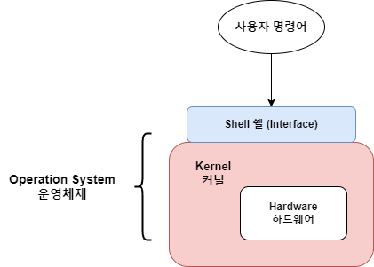

#### 운영체제 Opearating System

- 사용자로 하여금 컴퓨터의 HW를 보다 쉽게 사용할 수 있도록  
	인터페이스를 제공해주는 SW
- HW => `중앙처리장치`, `기억장치`, `통신장치`, `입출력 장치` 구분

---
#### OS의 목적 ('OS 기능' 보는 게 맞는 듯...)

| 목적                | 설명                                                                                                   |
| ----------------- | ---------------------------------------------------------------------------------------------------- |
| **사용자 편리성 제공**    | 한정된 시스템 자원 효과적으로 사용할 수 있도록 관리 및 운영  입출력 편의 제공, 사용자가 하드웨어 접근 용이하게 함.                              |
| **인터페이스 기능 담당**   | 컴퓨터 시스템과 사용자를 연결함                                                                                    |
| **Scheduling 담당** | 다중 사용자와 다중 응용 프로그램 환경 하에서  자원의 현 상태 파악하고 자원 분배를 위한 Scheduling 담당  프로세서, 메모리 등의 자원 Scheduling |
| **자원 관리**         | CPU, 메모리, 기억 장치, IO 장치 등의 자원을 관리                                                                     |
| **제어 기능**         | IO 장치와 사용자 Program 제어                                                                                |
| **오류 회복 기능**      | SW와 HW에 Error가 발생하면 자체 회복을 시도한다.                                                                     |

---
#### OS 성능 평가 기준 ★★

- 경과 시간, 응답 시간, 사용 가능도, 신뢰성, 처리량
- 위의 다섯 가지가 OS 성능 평가의 기준이 된다.

| 평가 기준                                  | 설명                                     |
| -------------------------------------- | -------------------------------------- |
| **경과 시간 (반환 시간)  Turnaround Time** | OS에 작업을 요구한 시간부터 처리가 완료될 때까지 걸린 시간 |
| **응답 시간 (반응 시간) Response Time**    | 작업이 처음 실행되기 전까지 걸린 시간                  |
| **사용 가능도 Availability**            | 시스템을 사용할 필요가 생겼을 때 즉시 사용 가능한 정도    |
| **신뢰성 Reliability**                | 시스템이 주어진 문제를 정확하게 해결하는 정도              |
| **처리량 Throughput**                 | 일정 시간 내에 시스템이 처리하는 일의 양                |

---

#### 운영체제의 기능

- 운영체제는 기능 별로 제어 프로그램과 처리 프로그램으로 구분된다.

##### 제어 프로그램 Control Program
- 시스템 전체의 움직임을 감사 감독 관리 및 지원하는 프로그램을 말한다.
- 제어 프로그램은 **'감시 / 작업 제어 / 데이터 관리'** 프로그램으로 나뉘어 진다.

| 종류                                          | 설명                                                               |
| ------------------------------------------- | ---------------------------------------------------------------- |
| **감시 프로그램 Supervisor Program**          | 각종 프로그램 실행과 시스템 전체의 작동 상태 감시 및 감독하는 Program                      |
| **작업 제어 프로그램 Job Control Program**      | 작업의 연속 처리를 위한 Schedule 및 시스템 자원 할당을 담당하는 Program             |
| **데이터 관리 프로그램 Data Management Program** | 주기억장치와 보조기억장치 사이의 데이터 전송과 보조기억장치의 자료 갱신 및 유지보수 기능을 수행하는 프로그램 |

##### 처리 프로그램 Processing Program
- 주어진 문제를 응용 프로그램 감독 하에 실제 데이터 처리를 하는 프로그램
- 처리 프로그램은 '**언어 번역** / **서비스** / **문제**' 프로그램으로 나눠진다.

| 프로그램 종류                       | 설명                                                                        |
| ----------------------------- | ------------------------------------------------------------------------- |
| 언어 번역 Language Translator | 원시 프로그램을 컴퓨터가 이해할 수 있는 기계어로 번역하는 프로그램 Asembler, Compiler, Interpriter |
| 서비스                           | 효율성을 위해 사용 빈도가 높은 프로그램 Library, Utility Program                       |
| 문제                            | 특정 업무 해결을 위해 사용자가 작성한 프로그램                                                |

---

#### Shell & Kernel

- OS, 운영체제는 Shell (Interface)과 Kernel의 구조를 가지고 있다.
- 여기서 Kernel (커널)은 OS의 핵심 기능들이 담겨있고
- Shell, 인터페이스는 사용자가 커널을 사용하기 편하게 해주는 도구라고 보면 된다.

#####  (1). 커널 Kernel

- 운영체제의 핵심 기능들이 모여있는 프로그램
- PC 부팅 시 주 기억 장치에 적재되고, 상주 하면서 실행된다.
- 프로그램과 하드웨어 간 인터페이스 역할을 담당한다.
- `Process 관리`, `기억장치 관리`, `주변장치 관리`, `파일 관리`가 커널의 기능에 속한다.
- (**'프 - 기 - 주 - 파'** 식으로 암기할 것)

##### (2). 쉘 Shell

- 사용자가 입력한 명령어 라인을 읽고, 필요한 시스템 기능을 실행시키는 명령어 해석기
- 시스템과 사용자 간의 인터페이스를 제공한다.
- 여러가지 내장 명령어를 가지고 있다.

---

#### OS 운용 기법

- 운영체제는 작업을 수행하는 방식에 따라  
	일괄 처리 시스템, 다중 프로그래밍 시스템, 다중 처리 시스템, 시 분할 시스템  
	실시간 처리 시스템, 분산 처리 시스템 등으로 나뉘어진다.

- **일괄 처리 시스템 Batch Processing System**
	- 시스템 효율 향상을 위해서 작업량이 일정한 수준이 될 때까지  
		모아뒀다가 일괄로 처리하는 시스템
	
- **다중 프로그래밍 시스템 Multi-Programming System**
	- 하나의 CPU와 주 기억장치를 이용하여 여러 개의 프로그램을 동시에 처리하는 방식

- **시 분할 시스템 Time Sharing System**
	- 여러 사용자가 CPU를 공유하고 있지만, 마치 자신만이 독점해서 사용하는 것처럼  
		느끼도록 처리하는 방식
	- 하나의 CPU는 같은 시점에 여러 작업을 동시에 수행할 수 없지만  
		작업을 사람이 느끼기 어려울 정도로 작은 단위의 작업 시간으로 번갈아 가며  
		작업을 처리하기 때문에 사용자가 자신이 CPU를 독점해서 사용하는 것처럼 느끼게 한다.
	- 다중 프로그래밍 시스템과 결합, 모든 작업이 동시에 진행되는 것처럼 대화 식 처리 가능

- **다중 처리 시스템 Multi-Processing System**
	- 여러 개의 CPU와 하나의 주 기억장치를 이용하여  
		여러 개의 프로그램을 동시에 처리하는 방식
	
- **분산 처리 시스템 Distributed Processing System**
	- 여러 개의 컴퓨터를 통신 회선으로 연결, 하나의 작업을 처리하는 방식
	- 여러 사용자가 데이터, 자원을 공유한다.
	- 시스템의 점진적 확장이 용이하고 **사용 가능도**가 향상된다.
	- 연산 속도의 향상과 신뢰성 증진을 특징으로 가지고 있다.
	
	- 단, 여러 개의 컴퓨터를 연결해서 하나의 작업을 처리하기 때문에  
		중앙 집중형 시스템보다 소프트웨어 개발이 어려움.

- **[중앙 집중형 시스템과 분산 시스템 / Velog](https://velog.io/@lixxce/%EB%B6%84%EC%82%B0%EC%BB%B4%ED%93%A8%ED%8C%85%EC%A4%91%EC%95%99-%EC%A7%91%EC%A4%91-%EC%8B%9C%EC%8A%A4%ED%85%9CCentralized-System%EA%B3%BC-%EB%B6%84%EC%82%B0-%EC%8B%9C%EC%8A%A4%ED%85%9CDistributed-System)**

 ---

#### 운영체제의 종류

- 운영체제는 크게 Windows, MacOS, Unix, Linux로 나눌 수 있다.
- 이 글에서는 MacOS를 제외한 나머지 운영체제에 대해서 간단한 소개 정도만 하고 넘어간다.
- 자세한 내용은 정보처리 산업 기사 필기 내용을 정리하다 보면 다루게 될 것이다.

##### Windows

- Microsoft 사에서 개발한 MS-DOS의 Multi-Tasking과 GUI 환경을 제공하는 운영체제
- 1995년에 출시된 Windows 95를 시작으로 Windows 98, ME, XP, 7, 8, 10, 11 순으로 업데이트
- 운영체제로서의 Windows가 갖는 특징은 다음과 같다.
	- **Graphic User Interface 환경 제공**
		- 키보드 없이 마우스로 아이콘 혹은 메뉴를 선택해서 작업을 수행하는
		- 그래픽 기반의 사용자 인터페이스
	- **선점형 Multi-Tasking 방식 제공**
	- **자동 감지 기능 제공**
	- **OLE (Object Linking and Embedding) 사용**

