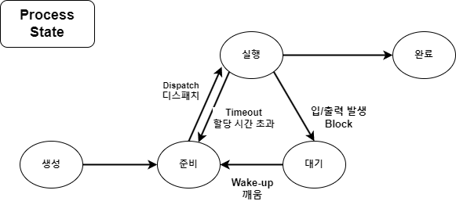
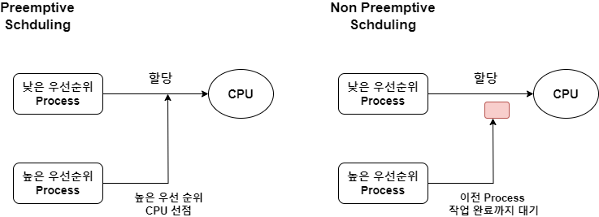
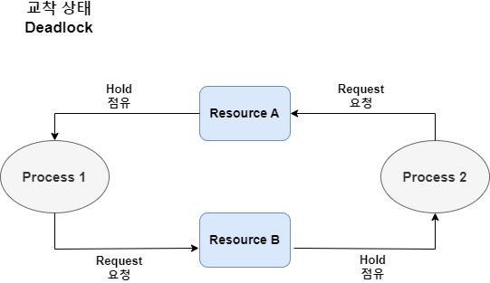

#### Process

- CPU에 의해 처리되는 사용자 프로그램
- 실행 중인 프로그램을 의미한다.
- 작업 혹은 Task라고도 한다.
- Processor가 활동 중인 것을 Process라고 하며 <br/>
	Process 생성 시 프로세스 제어 블록이 만들어진다.

- **프로세서 제어 블록 Process Control Block, PCB**
	- 운영체제가 프로세스 관리를 위해 필요한 자료를 담고 있는 자료구조

- 여기서 프로세스에서 실행 제어만 분리한 실행 단위를 **Thread**라고 하며 <br/>
	1개의 Process는 여러 개의 Thread 가질 수 있다.
	
- Process는 주 메모리에 저장되고, 여러 개의 Process를 동시에 띄울 수 있다.

---

#### Process State

- 하나의 Process는 여러 가지 event에 의해 일련의 서로 구분되는 상태 변화를 겪는다.
- Process는 **생성 → 준비 → 실행 → 대기 → 완료** 상태를 가진다.



| 프로세스 상태                | 설명                                                                                                 |
| ---------------------- | -------------------------------------------------------------------------------------------------- |
| **생성 상태<br/>Create**   | 사용자에 의해 프로세스가 생성된 상태                                                                               |
| **준비 상태 <br/>Ready**   | CPU 할당 받을 수 있는 상태<br/> **준비 리스트**: 각각의 우선 순위를 부여하고 <br/>가장 높은 순위를 갖는 프로세스가 다음 순서의 CPU 할당 받는다.      |
| **실행 상태 <br/>Running** | 프로세스가 CPU 할당 받아 동작, 실행 중인 상태                                                                       |
| **대기 상태<br/>Waiting**  | 프로세스 실행 중, IO 처리 등으로 인해 CPU 양도하고 <br/>IO 처리가 완료될 때까지 대기 리스트에서 기다리는 상태 <br/>**대기 리스트** : 우선 순위 존재 X |
| **완료 상태<br/>Complite** | 프로세스가 CPU 할당 받아 주어진 시간 내에 <br/>완전히 수행을 종료하는 상태                                                     |

---

#### Process State Transition, 프로세스 상태 전이

- 위의 그림에서 프로세스의 상태가 생성된 이후 완료되기 전까지 <br/>
	준비, 실행, 대기 상태 등으로 변하는 것을 확인할 수 있다.
- 이때 프로세스의 상태가 변하는 활동을 프로세스 상태 전이라고 한다.

- **Dispatch (디스패치)**
	- `준비` 상태인 여러 Process 중 실행될 프로세스를 선정하여 CPU 할당하는 것 (dispatching)
	- 완료되면 프로세스의 상태는 `준비`에서 `실행` 상태로 전이된다.

- **Timeout (할당 시간 초과)**
	- CPU 할당 받은 프로세스는 지정 시간이 초과되면 Scheduler에 의해 PCB에 저장
	- CPU 반납 후 다시 `준비` 상태로 전이된다.
	- Time Slice 만료 혹은 Preemption (선점) 시 Timeout 발생한다.
	- Time Slice: 다중 프로그래밍 시스템에서 CPU 시간 공유 목적으로 분할 제공되는 시간
	
- **Block (I/O 발생)**
	- `실행` 상태인 프로세스가 지정된 할당 시간을 초과하기 전에 I/O 발생이나 <br/>
		기타 사건이 발생하면 CPU 스스로 반납하고 I/O가 완료될 때까지 <br/>
		대기 (Block) 상태로 전이된다.
	- `실행` → `대기`
	- 즉시 실행 불가능한 System Call, I/O 작업 시작, 프로세스 간 통신 시에 Block이 발생한다.

- **Wake-up (깨움)**
	- 어느 시점에서 I/O 작업이 종료되면 대기 상태의 프로세스에게<br/>
		이 사실을 Wait & Signal 등에 의해 알리고 `준비` 상태로 전이된다.
	- `대기` → `준비`

---

#### Process Scheduling, `프로세스 스케쥴링` ☆☆☆



- CPU 사용하려고 하는 프로세스들 사이의 우선 순위를 관리하는 작업
- 특정 프로세스가 적합하게 실행되도록 `프로세스 스케쥴링`에 의해 <br/>
	프로세스 사이에서 CPU 교체가 발생한다.

```
Process Scheduling의 목적
- 모든 작업에 대한 공평성을 유지해야 한다.
- 처리량 (처리율, CPU 이용률)을 최대화해야 한다.
- 경과 시간의 예측이 가능해야 한다.
- Overhead, 응답시간, 반환시간, 대기시간을 최소화 해야한다.
```

- `프로세스 스케쥴링`은 방식에 따라 `선점형 스케쥴링`과 `비선점형 스케쥴링` 나뉘어진다.

---
##### `선점형 스케쥴링` / Preemptive Scheduling

- 하나의 Process가 CPU 차지하고 있을 상황에서 우선 순위가 높은 Process가 들어오면 <br/>
	현재 프로세스를 Block (대기)하고, CPU 점유하는 Schduling 방식
- 장점: 비교적 빠른 응답 시간을 가지고, 대화 식 시 분할 시스템에 적합하다.
- 단점: 높은 우선 순위의 Process가 들어오는 경우 ***Overhead***가 초래될 수 있다.
- SRT (Shortest Remaining Time First), 다단계 큐, 다단계 피드백 큐, 라운드 로빈 방식이 존재한다.

```
Overhead
=> 프로그램 실행 흐름에서 나타나는 현상 중 하나
=> 프로세스 실행 도중, 다른 프로세스를 실행해야 할 경우가 생겼을 때
	추가적인 시간이나 메모리 등의 자원이 사용되는 현상
=> 특정 기능을 수행하는데 드는 간접적인 시간, 메모리 등의 자원
```

---

##### `비선점형 스케쥴링` / Non Preemptive Scheduling

- 한 Process가 CPU 할당 받은 상태에서 작업 종료되고 CPU 반환하기 전까지
- 다른 Process가 CPU 점유할 수 없는 Scheduling 방식
- 장점: 응답 시간을 예상하기 수월하며, 모든 Process에 대한 요구를 공정하게 처리한다.
- 단점: 짧은 작업을 수행하는 Process가 있다고 해도, 현 작업 시간이 길어도 <br/>
		작업이 종료되기 전까지 대기한다.
- **Non Preemptive Scheduling 유형**
	- **Priority (우선 순위)**
		- 각 프로세스 별로 우선 순위가 주어지고, 우선 순위에 따라 CPU 할당
		- 주요 긴급 프로세스에 대한 우선 처리
		- 설정, 자원 상황 등에 따라 우선 순위를 선정한다.
		
	- **Deadline**
		- 작업들이 명시된 시간이나 기한 내에 완료되도록 계획
		- 요청에 명시된 시간 내 처리를 보장
	
	- **FCFS (First Come First Served)**
		- 프로세스가 대기 큐에 도착한 순서에 따라 CPU 할당함.
		- First In First Out 방식
	
	- **SJF (Shortest Job First)**
		- 프로세스가 도착하는 시점에 따라 그 당시 가장 작은 서비스 시간을 갖는 <br/>
			프로세스가 종료 시까지 자원을 점유한다.
		- 준비 Queue 작업 중 가장 짧은 작업부터 수행, 평균 대기 시간 최소
		- CPU 요구 시간이 긴 작업과 짧은 작업 간의 불평등 심함
		- CPU 요구 시간이 긴 프로세스는 ***기아 현상***이 발생한다.
	
	- **HRN (High Response Ratio Next)**
		- 대기 중인 프로세스 중 대기 시간이 긴 프로세스는 우선 순위를 높여서 <br/>
			프로세스의 우선 순위를 결정하는 Scheduling 기법
		- 서비스 받을 시간, 기다린 시간을 고려해서 가변적 우선 순위를 결정한다.
		- 우선 순위 계산 식의 수치가 가장 높은 것부터 낮은 순으로 <br/>
				우선 순위를 부여해서 SJF의 약점인 ***기아 현상*** 보완한 기법
		- 긴 작업과 짧은 작업 간 지나친 불평등을 해소하는 기법

```
기아 현상 (Starvation 현상)
- 시스템 부하가 많아서 낮은 등급의 준비 Queue에 있는 
	프로세스가 무한정 기다리는 현상
```

---

#### 프로세스 교착 상태

##### 교착 상태 (Deadline)



- 다중 Processing 환경에서 2개 이상의 프로세스가 특정 자원 할당을 무한정 대기하는 상태
- 이러한 교착 상태가 발생하는 조건은 다음과 같다.

| 발생 조건                          | 설명                                                                  |
| ------------------------------ | ------------------------------------------------------------------- |
| **상호 배제<br/>Mutual Exclusive** | 프로세스가 자원을 **배타적으로 점유**하여 <br/>다른 프로세스가 그 자원을 사용할 수 없는 상태            |
| **점유와 대기<br/>Hold & Wait**     | 한 프로세스가 자원을 **점유**하고 있으면서 <br/>또 다른 자원을 요청하여 **대기**하고 있는 상태         |
| **비 선점 <br/>Non Preemption**   | 한 프로세스가 점유한 자원에 대해 다른 프로세스가 선점할 수 없고 <br/>오직 점유한 프로세스 만이 해제가 가능한 상태 |
| **원형 대기 <br/>Circular Wait**   | 2개 이상의 Process 간 자원의 점유와 대기가 하나의 원형을 구성한 상태                         |
- 이러한 교착 상태를 해결하는 방법은 다음과 같다.

| 기법                     | 설명                                                                        | 세부 기법                                |
| ---------------------- | ------------------------------------------------------------------------- | ------------------------------------ |
| **예방 <br/>Prevention** | 상호 배제를 제외한 나머지 교착 상태 <br/>발생 조건을 위배, 하는 방안                                | 점유 자원 해제 후 <br/>새 자원 요청              |
| **회피 <br/>Avoidance**  | 교착 상태의 발생 가능성을 배제하지 않고 <br/>이를 적절하게 **피해나가는 방법**                          | *은행원 알고리즘* <br/>Wound-wait, Wait-die |
| **발견 <br/>Detection**  | 시스템의 상태를 감시 알고리즘 통해서 <br/>교착 상태를 검사하는 방법                                  | 자원 할당 그래프 <br/>Wait for Graph        |
| **복구 <br/>Recovery**   | 교착 상태가 없어질 때까지 <br/>프로세스를 Kill, 순차적으로 제거 <br/>희생될 프로세스 선택해야 한다. 기아 상태가 발생 | Process Kill <br/>자원 선점              |

```
은행원 알고리즘
- 사용자 Process는 사전에 자기 작업에 필요한 자원의 수를 제시하고
- 운영체제가 자원 상태를 감시, 안정 상태인 경우에만 자원을 할당하는
- 교착 상태 '회피' 기법
```


---
