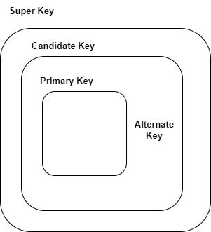
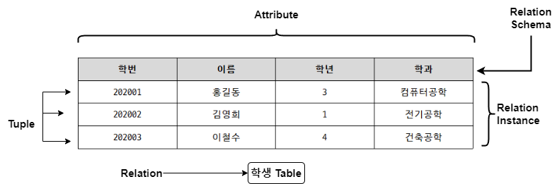

### 데이터베이스 (database)

- 다수의 인원, 시스템 혹은 프로그램이 사용할 목적으로  
	통합하여 관리하는 데이터의 집합
- 데이터에 대한 효과적인 관리를 위해 자료의 중복성 제거, 무결성 확보  
	일관성 유지, 유용성 보장이 중요하다.
- DB == 통합 데이터, 저장 데이터, 운영 데이터, 공용 데이터이다.

| 정의                           | 의미                                  |
| ---------------------------- | ----------------------------------- |
| 통합 데이터  Intergrated Data | 자료의 중복을 배제한 데이터의 모임                 |
| 저장 데이터  Stored Data      | 저장 매체에 저장된 데이터                      |
| 운영 데이터  Operational Data | 존재 목적이나 유용성 측면에서 존재 가치가 확실한 필수적 데이터 |
| 공용 데이터  Shared Data      | 여러 애플리케이션, 시스템들이 공동으로 사용하는 데이터      |

- 데이터베이스는 다음과 같은 특징을 가진다.

| DB 특징                                | 의미                                                                                                             |
| ------------------------------------ | -------------------------------------------------------------------------------------------------------------- |
| 실시간 접근성  Real-Time Accessibility | 사용자의 데이터 요구, 쿼리에 실시간으로 응답할 수 있어야 함  사용자의 개인 특성, 제공 서비스 유형에 따라  응답 시간이 다르지만 빠른 시간 내에 데이터를 제공해야 한다.      |
| 계속적인 변화  Continuous Evolution    | 현실 세계의 상태를 정확히 반영해야 하는 DB는 동적이다.  데이터를 계속 삽입 (Insert), 삭제 (Delete), 수정 (Update)하여 항상 최신의 데이터를 유지해야 한다. |
| 동시 공용  Concurrent Sharing        | 다수의 사용자가 동시에 같은 내용의 데이터를 이용할 수 있어야 함                                                                           |
| 내용 참조  Content Reference         | DB에 저장된 데이터의 주소, 위치가 아닌 데이터 내용  즉, 값 (value)으로 사용자가 요구하는 데이터를 찾아야 한다.                                      |

---

### DBMS

#### DBMS의 정의

- Database Management System, 데이터베이스 관리 시스템
- 다수의 사용자가 DB 내 데이터에 접근할 수 있도록 해주는 SW
- 파일 시스템의 데이터 중복과 데이터 종속 문제를 해결하기 위해 제시된 SW

- **DBMS의 장점 / 단점**

| DBMS 장점    | 설명                                                          |
| ---------- | ----------------------------------------------------------- |
| 데이터 중복 최소화 | 데이터의 중복을 최소화하여 기억 공간을 절약한다.                                 |
| 데이터 무결성 유지 | 정확한 최신 정보의 이용 가능하고, 정확한 데이터가 저장되어 있음  즉, 데이터 무결성이 유지된다. |
| 데이터 공유     | 다수의 사용자가 서로 다른 목적으로 데이터를 공유하는 것이 가능함                        |

| DBMS 단점    | 설명                                                                   |
| ---------- | -------------------------------------------------------------------- |
| 예비와 회복 어려움 | DB는 실시간으로 여러 사용자가 동시에 사용하기 때문에  데이터의 Backup과 회복 (Recovery)가 어렵다. |
| 비용 증가      | DB 구축 비용 및 시스템 운영 비용이 증가                                             |

#### DBMS의 주요 기능 ☆☆

- DBMS가 제공하는 주요 기능들은 다음과 같다.

- **정의 기능 Definition Facility**
	- DB 구조 (Table, 관계) 정의하거나 수정할 수 있음.

- **조작 기능 Manipulation Facility**
	- 데이터를 입력, 수정, 삭제, 조회하는 등의 연산을 할 수 있음.
	
- **제어 기능 Control Facility**
	- 데이터를 항상 정확하고 안전하게 유지할 수 있다.
	- 데이터 보안, 무결성 유지하고 병행 수행 제어, 회복 기능을 가진다.

| 제어 기능     | 설명                                                             |
| --------- | -------------------------------------------------------------- |
| 데이터 보안 유지 | 불법적인 사용자로부터 데이터를 보호하는 기능                                       |
| 무결성 유지    | 데이터 정확성, 일관성을 유지하는 기능                                          |
| 병행 수행 제어  | 여러 트랜잭션 수행 시, 트랜잭션들이 DB 일관성 파괴하지 않도록  트랜잭션 간 상호작용을 제어하는 기능 |
| 회복        | DB 장애가 발생할 경우, DB를 장애 발생 이전 상태로 복원하는 기능                        |

---

### 데이터베이스 무결성 Database Intergrity

- DB에 저장된 데이터 값과 그것이 표현하는 현실 세계의 실제 값이 일치하는 성질
- DB 무결성을 유지하는 것 == DBMS의 중요한 기능  
	데이터에 적용되는 연산에 제한을 둬서 데이터 무결성을 유지한다.
- 무결성은 권한이 있는 사용자로부터 DB를 보호하는 역할도 한다.
- DB 무결성을 구현하는 방식은 다음과 같다.

- 개체 무결성
	- 한 Entity에서 같은 기본 키를 가질 수 없거나   
		기본 키의 속성이 NULL 허용할 수 없는 제약 조건
	- 주 기법: `Primary Key (기본 키)`, `Unique Index`

- 참조 무결성
	- 외래 키가 참조하는 다른 개체의 기본 키에 해당하는 값이  
		기본 키의 값이나 NULL이어야 하는 제약 조건
	- 주 기법: `Foreign Key (외래 키)`
	
- 속성 무결성
	- 속성의 값은 `기본값`, `null 여부`, `domain (데이터 타입, 길이)`가   
		지정된 규칙을 준수해야 하는 제약 조건
	- 주 기법: `Check`, `NULL / NOT NULL`, `Default (기본값)`
	
- 사용자 무결성
	- 사용자의 의미적 요구사항을 준수해야 하는 제약 조건
	- 주 기법: `Trigger`, `User Defined Data Type`
	
- 키 무결성
	- 한 relation에 같은 키 값을 가진 Tuple 허용할 수 없는 제약 조건
	- 주 기법: `Unique`

---
### Key ☆☆

- DB에서 조건을 만족하는 Tuple 찾거나 순서대로 정렬할 때  
	다른 Tuple과 구별할 수 있는 기준이 되는 속성
- Tuple : DB 내의 주어진 목록과 관계있는 속성 값의 모음, Column (열)
- DB에서 사용되는 키는 다음과 같다.

#### Key 종류

- **Primary Key (기본 키)**
	- Table의 각 Tuple들을 고유하게 식별하는 Column
	- 후보 키 중에서 대표로 선정된 키
	
- **Alternate Key (대체 키)**
	- 후보 키 중에서 기본 키, Primary Key 선택되지 않은 키
	
- **Candidate Key (후보 키)**
	- 테이블에서 각 Tuple 구별하는데 기준이 되는 Column
	- 후보 키 == Primary + Alternate
	- **`유일성`**, **`최소성`** 특성으로 가진 키
		- **`유일성`**: 식별자에 의해 Entity 타입 내 모든 Entity들이 유일하게 구분
		- **`최소성`**: 최소한의 속성으로 식별자 구성

- **Super Key (슈퍼 키)**
	- Relation 구성하는 모든 Tuple에 대해 유일성은 만족하지만
	- 최소성은 만족하지 못하는 키

- **Foreign Key (외래 키)**
	- Table 간 참조 데이터 무결성을 위한 제약 조건
	- 한 Relation의 Column이 다른 Relation의 기본 키로 이용되는 키

---

### Relation ☆☆

#### Relation 정의

- 데이터를 저장하는 항목인 Field로 구성된 데이터의 집합체
- DB에 표현하려고 하는 현실 세계의 대상체
- 유형. 무형의 정보로서 서로 연관된 몇 개의 속성으로 구분된다.

| 구성               | 설명                                                                                                           |
| ---------------- | ------------------------------------------------------------------------------------------------------------ |
| Tuple            | Table 내 행 (Row) 의미한다.  모든 Tuple은 Relation 내에서 서로 다른 값을 가진다. (==같은 값을 가질 수 없다.)                       |
| Cardinality      | Tuple의 수                                                                                                     |
| Attribute (속성)   | Table 내의 열, Column 의미한다.  DB 구성하는 가장 작은 논리적 단위  파일 구조 상의 데이터 항목 혹은 데이터 필드에 해당된다.  속성 => 개체 특성 기술 |
| Degree (치수)      | 속성, Attribute의 수                                                                                             |
| Schema           | DB의 구조, 제약 조건 등의 정보를 담고 있는 기본적인 구조                                                                           |
| Instance         | 정의된 Schema에 따라 생성된 Table에 실제 저장된 데이터 집합                                                                      |
| Identifier (식별자) | 여러 개의 집합체를 담고 있는 RDBMS에서  각각을 구분할 수 있는 논리적인 개념                                                           |
| Domain           | 하나의 속성이 취할 수 있는 같은 타입의 원잣값들의 집합                                                                              |

- Relation에 포함된 Tuple과 Attribute 사이에는 별도의 순서가 없다.
- 각 속성들은 Relation 내에서 유일한 이름을 가지며  
	여기서 모든 속성 값들은 원자 값이다.
