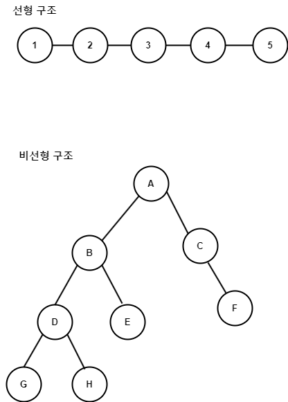

### Data Structure, 자료구조

- 컴퓨터 상 자료를 효율적으로 저장하기 위해서 만들어진 논리적인 구조
- 자료구조의 현명한 선택을 통해 효율적인 알고리즘을 사용할 수 있게 하여 성능 향상 시킴
- 자료구조는 크게 선형 구조와 비선형 구조로 나뉜다.

| **구조**                 | **설명**                                                    | 종류                 |
| ---------------------- | --------------------------------------------------------- | ------------------ |
| 선형 구조  Linear      | 데이터를 연속적으로 연결한 자료구조  자료를 구성하는 원소들을 하나씩 순차적으로 나열한 형태   | 리스트, 스택  큐, 데크 |
| 비선형 구조  Non-Linear | 데이터를 비연속적으로 연결한 자료구조  하나의 자료 뒤에 여러 개의 자료가 존재할 수 있는 형태 | 트리, 그래프            |

---

#### 선형 구조 / 리스트 List

- **선형 리스트 Linear List**
	- 배열과 같이 연속되는 기억 장소에 저장되는 리스트
	- 대표적인 선형 리스트: 배열 Array
	- 가장 간편한 자료구조, 접근 구조가 빠르다.
	- 자료의 삽입, 삭제 시 기존 자료의 이동이 필요함.

- **연결 리스트 Linked List**
	- Node의 Pointer 부분으로 서로 연결한 리스트
	- 연결 방식에 따라 `단순 연결 리스트`, `원형 연결 리스트`  
		`이중 연결 리스트`, `이중 원형 연결 리스트`로 구분된다.
	* Node의 삽입, 삭제가 선형 리스트와 달리 편리한 편이다.
	* 연결을 위한 Pointer가 추가되어 저장 공간이 추가로 필요하고  
		Pointer 통해서 찾는 시간이 추가됐기 때문에 선형 리스트에 비해 느린 편이다.

---
#### 선형 구조 / 스택 Stack

- 한 방향으로만 자료를 넣고 꺼낼 수 있는 LIFO 형식의 자료구조
- LIFO => Last In First Out, 마지막에 넣은 것이 먼저 나간다.

- 한 방향으로만 `PUSH`와 `POP` 이용하여 자료를 넣고 꺼낸다.
- 스택의 가장 위에 있는 데이터는 `TOP`이라고 하며  
	Stack Pointer라고도 부른다.

- `PUSH` 연산 : 데이터를 차례대로 스택에 추가하는 연산
- `POP` 연산 : 스택에서 가장 위에 있는 데이터를 하나씩 꺼내는 연산
- 이러한 자료구조 스택은 인터럽트 처리, 함수 호출  
	후위 표현 연산 (수식 계산), 깊이 우선 탐색 (DFS)에서 응용할 수 있다.

| 스택 운용 분야                         | 설명                                                                                                   |
| -------------------------------- | ---------------------------------------------------------------------------------------------------- |
| 인터럽트 처리                          | 현재 진행 중인 명령어 위치를 스택에 `Push`  인터럽트 발생 상황을 처리한 후, 인터럽트 전에 진행 중이던  명령어 위치를 스택에서 `Pop` 통해서 받아온다. |
| 함수 호출  (재귀함수 포함)             | 함수 호출 시, 현재 진행 중인 명령어 주소를 스택에 이양한다.                                                                  |
| 후위 표현 연산                         | `Postfix` 계산할 때 사용                                                                                   |
| 깊이 우선 탐색  Depth First Search | 깊이 내려갈 때마다 스택에 값을 `Push`하고  더이상 깊이 내려갈 곳이 없으면 스택에서 `POP`한 node와  인접한 node를 탐색한다.             |

---

#### 선형 구조 / 큐 Queue

- 한쪽 끝에서 삽입 작업이 이뤄지고, 반대쪽 끝에서는 삭제 작업이 이뤄지는  
	First In First Out 형식의 자료구조를 말한다.

- 한 방향에서는 `ENQUEUE` 연산을 이용하여 데이터 입력이 이뤄지고  
	다른 쪽 방향에서는 `DEQUEUE` 연산을 이용하여 데이터 출력이 이루어진다.
- 데이터를 꺼내는 쪽, 출력 부분에 가장 가까운 쪽을 Front  
	데이터를 넣는 쪽, 입력 부분에 가장 가까운 쪽을 Rear라고 한다.

- `ENQUEUE` : 데이터를 차례대로 넣는 연산
- `DEQUEUE`: 처음 저장된 데이터부터 하나씩 꺼내는 연산
- 큐는 운영체제의 작업 Scheduling, 메시지 전송 분야에서 활용할 수 있다.

| Queue 응용           | 설명                                   |
| ------------------ | ------------------------------------ |
| 운영체제 작업 Scheduling | 작업이 자원을 할당 받기 전까지 대기                 |
| 메시지 전송             | 메시지를 한 곳에서 다른 한 곳으로 전송하는 동안 일시적으로 보관 |

---

##### 선형 구조 / 데크 Deque

- Deque == Double Ended Queue
- 큐의 양쪽 끝에서 삽입과 삭제를 할 수 있는 자료구조

- 두 개의 Pointer 사용하여, 양방향에서의 삽입 / 삭제가 가능하다.
- Deque 이용한 Stack과 Queue 구현하는 것도 가능하다.
- `PUSH` 연산을 통해 큐의 양쪽 끝에서 데이터의 삽입을 진행하고  
	`POP` 연산을 통해 Deque의 Front와 Rear에 있는 데이터를 하나씩 꺼낼 수 있다.

---
#### 비선형 구조 / 트리 Tree

