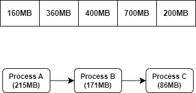

## 메모리 관리

- 다중 프로그래밍 컴퓨터에서 OS는 메모리의 일부에 상주하고
- 나머지는 여러 Process에서 사용된다.
- 이때 서로 다른 프로세스 간에 **메모리를 세분화**하는 작업을 **메모리 관리**라고 한다.
- 메모리 관리는 운영 체제에서 프로세스 실행 중에 <br/>
	주 메모리와 디스크 간의 작업을 관리하는 방법이다.
- 메모리 관리는 '**메모리를 효율적으로 사용하기**' 주요 목표로 가지고 있다.

---

### 메모리 관리 기법

- 메모리는 기본적으로 고가의 자원이고 시스템에서 중요한 역할을 하기 때문에
- 이러한 메모리를 관리하는 메모리 관리는 운영체제가 가진 역할 중 꽤 큰 비중을 차지한다.
- 메모리 관리 기법으로는 반입 / 배치 / 할당 / 교체 기업이 존재한다.

#### 메모리 반입 (Fetch) 기법
- 주 메모리에 적재할 다음 프로세스의 반입 시기를 결정하는 기법
- 메모리 적재 시기를 결정하는 기법
- 요구 반입 기법과 예상 반입 기법으로 나뉜다.

| 기법           | 설명                                                               |
| ------------ | ---------------------------------------------------------------- |
| **요구 반입 기법** | 다음에 실행될 프로세스가 참조 요구가 있을 경우에 적재하는 기법                              |
| **예상 반입 기법** | 시스템의 요구를 예측하여 미리 메모리에 적재하는 방법<br/>요구되는 페이지 이외 다른 페이지도 함께 적재하는 방법 |

#### 메모리 배치 (Placement) 기법 ☆☆☆

- 디스크에 있는 프로세스를 주 메모리의 어느 위치에 저장할 것인지 결정하는 기법
- 메모리 적재 위치를 결정하는 기법
- 배치하는 방식에 따라 '최초 / 최적 / 최악' 적합으로 나뉘어 진다.

| 기법                      | 설명                                                                                   |
| ----------------------- | ------------------------------------------------------------------------------------ |
| **최초 적합<br/>First-Fit** | 프로세스가 적재될 수 있는 공간 중에서<br/>첫 번째 공간부터 순서대로 할당하는 방식                                     |
| **최적 적합<br/>Best-Fit**  | 가용 공간 중 프로세스와 가장 크기가 비슷한 공간을 선택해서 <br/>프로세스를 적재하는 방식 <br/>공백을 최소화할 수 있다는 장점을 가지고 있다. |
| **최악 적합<br/>Worst-Fit** | 프로세스의 가용 공간 중에서 가장 큰 공간에 할당하는 방식 <br/>가용 공간과 프로세스 간 크기 비교하고 가장 크기 차이가 큰 공간에 할당한다.    |

#### 배치 기법 - 추가 설명

- 아래 이미지와 같은 공간을 가지고 있는 메모리가 있다고 가정해보자.
- 이제 프로세스 A → 프로세스 B → 프로세스 C 순으로 메모리에 적재를 한다고 해보자.
- 이때 메모리 배치 기법이 최초, 최적, 최악 적합이냐에 따라 각기 다른 식으로 배치된다.



```
(1). 최초 적합 First Fit
- 프로세스를 적재할 수 있는 공간 중 첫번째부터 순서대로 할당하는 방식
- 프로세스 A는 첫번째 공간에 할당하기에는 크기가 크기 때문에
- 360MB의 크기를 가진 두번째 공간에 할당되고
	이후 세번째 공간에는 프로세스 B가 할당된다
- 그 다음 네번째 공간에 프로세스 C가 할당되야 할 것 같지만
- 첫번째 공간이 비어있기 때문에 다시 돌아와서 
	86MB 크기를 가진 프로세스 C를 첫번째 공간에 할당한다.
- [ 160 | 360 | 400 | 700 | 200 ]
- [  C  |  A  |  B  |     |     ]

(2). 최적 적합 Best Fit
- 메모리의 가용 공간 중 프로세스와 크기가 비슷한 공간을 선택해서
	프로세스를 할당하는 방식
- 프로세스 A (215MB), 이와 가장 비슷한 크기를 가진
	360MB 크기를 가진 공간, 두번째 공간에 할당된다.
- 프로세스 B (171MB), 이와 가장 비슷한 크기를 가진 
	200MB의 크기를 가진 공간, 다섯번째 공간에 할당된다.
- 프로세스 C (86MB), 이와 가장 비슷한 크기를 가진
	160MB의 크기를 가진 공간, 첫번째 공간에 할당된다.
- [ 160 | 360 | 400 | 700 | 200 ]
- [  C  |  A  |     |     |  B  ]

(3). 최악 적합 Worst Fit
- 메모리의 가용 공간 중 프로세스와 크기 차이가 가장 큰 공간을 선택해서
	배치하는, 말 그대로 최악의 방식
- 프로세스 A (215MB), 첫번째를 제외한 2 ~ 5번째 공간 중 
	가장 차이가 큰 700MB의 크기를 가진 4번째 공간에 할당된다.
- 프로세스 B (171MB), 1, 4를 제외한 나머지 2, 3, 5번째 공간 중
	가장 차이가 큰 400MB의 크기를 가진 3번째 공간에 할당된다.
- 프로세스 C (86MB), 3, 4번째 공간을 제외한 나머지 1, 2, 5번째 공간 중
	가장 차이가 큰, 360MB의 크기를 가진 2번째 공간에 할당된다.
- [ 160 | 360 | 400 | 700 | 200 ]
- [     |  C  |  B  |  A  |     ]
```


---

#### 메모리 할당 (Assignment) 기법

- 주 메모리에 실행해야 할 프로세스를 **어떤 방법으로 할당**할 것 인지를 결정하는 기법
- 적재하는 방법에 따라 '**연속 할당 기법**', '**분산 할당 기법**'으로 나뉘어진다.

| 기법       | 설명                                                                                          |
| -------- | ------------------------------------------------------------------------------------------- |
| 연속 할당 기법 | 실행을 위한 각 프로세스를 주 메모리 공간 내에서 <br/>인접되게 연속하여 저장하는 방법<br/>단일 분할과 다중 분할 기법으로 나뉘어진다.             |
| 분산 할당 기법 | 하나의 프로세스를 여러 조각으로 나누고 <br/>주 메모리 공간 내 분산하여 배치하는 기법 <br/>페이징, 세그먼테이션, 페이징/세그먼테이션 기법으로 나뉘어진다. |

---

#### 메모리 교체 (Replacement) 기법 / 메모리 대체 기법

- **참고할만한 Article**
	- **[교체 기법 (Replacement strategies)](https://velog.io/@minu/7.2.-%EA%B5%90%EC%B2%B4-%EA%B8%B0%EB%B2%95-Replacement-strategies#12-random-algorithm)**
	- **[가상 메모리와 페이지 폴트](https://velog.io/@jiseong/OS-%EA%B0%80%EC%83%81%EB%A9%94%EB%AA%A8%EB%A6%AC%EC%99%80-%ED%8E%98%EC%9D%B4%EC%A7%80%ED%8F%B4%ED%8A%B8-gyq8tftz)**

---
- 주 메모리에 있는 프로세스 중 어떤 프로세스를 제거할 지를 결정하는 기법
- 가상 메모리 관리자 입장에서 비어있는 메모리 공간이 많을 수록 작업은 쉬워진다. <br/>
	예를 들어서 Page Fault가 발생하면 빈 페이지 리스트에서 비어 있는 페이지를 찾아서 <br/>fault를 일으킨 페이지에 할당하는데 이때 빈 메모리 공간이 거의 없으면 <br/>
	일이 다소 복잡해진다.
- 이런 경우 운영체제는 메모리 공간 부족을 해소하기 위해서<br/>
	다른 페이지를 강제적으로 Paging Out하여 활발히 사용 중인 페이지들을 위한 <br/>
	공간을 확보한다.
- 즉, 새로운 페이지를 할당하기 위해서 현재 할당된 페이지 중 어떤 것과 교체할 지를 <br/>
	결정하는 기법이라고 할 수 있다.
- 이때 교체할 페이지를 결정하는 관리 기법은 아래와 같이 있다.
- FIFO, LRU, LFU, OPT, NUR, SCR, ...

---

#### FIFO, First In First Out

- 주 메모리의 페이지에 순차적으로 참조 String이 들어오고 <br/>
	페이지 교체는 가장 먼저 들어온 페이지부터 교체하는 기법
- 각 페이지가 주 메모리에 적재될 때마다 그 시간을 기억하고 <br/>
	가장 먼저 들어왔던 페이지를 교체하는 기법
- 말 그대로, 先入先出 기법

---

#### LRU, Least Recently Used

- 사용된 시간을 확인하여 가장 오랫동안 사용되지 않은 페이지를 선택, 교체하는 기법
- 프로그램의 **지역성**의 원리에 따라 최근에 참조된 페이지는 앞으로도 <br/>
	참조될 가능성이 크고, 최근에 참조되지 않은 페이지는 앞으로도 참조되지 않는다 <br/>
	전제로 두고 구현된 알고리즘
- **지역성**: 프로세스가 실행되는 동안 주 메모리를 참조할 때 <br/>
		일부 페이지만 집중적으로 참조하는 특성

---

#### LFU, Least Frequently Used

- 사용된 횟수를 확인, 참조 횟수가 가장 적은 페이지를 선택, 교체하는 기법
- 메모리에 저장된 페이지 중 사용한 횟수가 가장 적은 페이지를 교체하는 기법

---

#### OPT, OPTimal Replacement
- 앞으로 가장 오랫동안 사용하지 않을 페이지를 교체하는 기법
- 페이지 부재 횟수가 가장 적게 발생하는 가장 효율적인 기법

---

#### NUR, Not Used Recently
- LRU 기법과 비슷하게 최근에 사용하지 않은 페이지를 교체하는 기법
- 최근에 사용하지 않은 페이지는 앞으로도 <br/>
	사용하지 않을 가능성이 있다는 것을 전제로, LRU에서 나타나는 <br/>
	시간적인 오버 헤드를 줄일 수 있다.
* 최근 사용 여부를 확인하기 위해서, 페이지마다 참조 비트와 변형 비트를 사용

---

#### SCR, Second Chance Replacement
- 가장 오랫동안 주 메모리에 있던 페이지 중 <br/>
	자주 사용되는 페이지의 교체를 방지하기 위한 기법으로 <br/>
	FIFO 기법의 단점을 보완하는 기법

---

