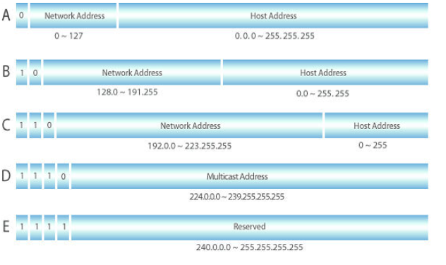

## Internet Protocol, IP

- 송신 host와 수신 host가 Packet Switching Network (Packet 교환 네트워크)에서 <br/>
	정보를 주고 받는데 사용하는 정보 위주의 규약을 말한다.
- OSI 7 계층, 네트워크 계층에서 host 주소 지정과 Packet 분할, 조립 기능을 담당
- IP의 정보는 Packet, Datagram이라고 하는 덩어리로 나뉘어 전송함

---
### IP의 특징

- **Unreliable & Connection less (`비신뢰성` & `비연결성`)**
	- 흐름에 관여하지 않기 때문에 보낸 정보가 제대로 전송됐는지 관여하지 않는 특성
	- Packet 전송, 정확한 순서를 보장하려면 TCP 프로토콜과 같은 <br/>
		IP의 상위 Protocol 이용해야 한다. <br/>
		(신뢰성이 중요한 전송에는 IP + TCP 활용)
		
- **에러 제어, 흐름 제어 X**
	- 정보의 전송이 가장 중요하고, 보낸 정보의 내용을 보장해주지는 않는다.
	- Packet은 Error 검출만 하고, 만일 Error가 발견되면 해당 Packet 폐기한다.

- **대표적인 IP Address 체계**
	- 현재 인터넷에서 사용하는 표준 프로토콜은 `IPv4` <br/>
		주소 공간 고갈 Issue로 인해 `IPv6` 점차 확산

- **IP 크기 제한**
	- IP 크기: 20 ~ 40 byte
	- IP Packet은 네트워크가 수용할 수 있는 크기로 분할해야 하는데 <br/>
		이를 **Fragementation (단편화)** 라 한다.
	- 인터넷으로 데이터를 전송할 경우, IP Packet 잘라서 보내고 <br/>
		이러한 단편화는 **`MTU`** 때문에 필요하다.

```
MTU
- Maximum Transmission Unit
- 인터넷에 연결된 장치가 수용할 수 있는 최대 데이터 패킷 크기
- 단위: byte
```

---

### IPv4, IP version 4

- 인터넷에 사용되는 Packet 교환 네트워크 상에서 데이터를 교환하기 위한 <br/>
	32bit 주소 체계를 갖는 네트워크 계층의 Protocol
	
* IPv4 주소 체계
	* 총 12자리, 10진수 구성, 네 부분으로 나뉜다.
	* 0 ~ 255까지 세 자리의 수로 표현된다.
	* `192.168.222.123`
	* 32bit IP 주소는 Network 나타내는 부분과 Host를 나타내는 부분으로 나뉜다.
	* Network 부분과 Host 부분을 구분하는 것이 Subnet Mask

- `192.168.222.123`에서 `192.168.222`는 Network 영역이고 <br/>
	나머지 `123`이 Host IP라는 것을 알 수 있다.
- 여기서 네트워크 주소와 호스트 주소를 구분할 때 사용하는 기법이 <br/>
	IPv4 네트워크 클래스를 활용해서 네트워크 주소와 호스트 주소를 구분한다.

- 클래스: 하나의 IP 주소에서 네트워크 영역과 호스트 영역을 나누는 방법 및 약속
- IP 주소 Class는 A, B, C, D, E Class로 총 5개의 class로 나뉜다.
- 통상적으로 사용되는 것은 A, B, C Class 정도이고 <br/>
	나머지 D, E Class는 멀티캐스트 용, 연구용으로 사용된다.



<br/>

- **`A 클래스`**
	- 가장 높은 단위의 Class
	- 1 ~ 126 범위의 IP 주소를 가진다. <br/>
		(0. 127로 시작되는 IP는 예약된 IP)
	- 2, 3, 4번째 단위의 세 숫자는 A Class에서 자유롭게 <br/>
		네트워크 사용자에게 부여가 가능한 IP
	- 범위: `0.0.0.0` ~ `127.255.255.255` <br/>
		(Subnet Mask: `255.0.0.0`)

- **`B 클래스`**
	- 두 번째로 높은 단위의 Class
	- 첫 번째 단위의 세 숫자는 128 ~ 191 사이의 숫자를 가진다.
	- 두 번째 단위의 세 숫자는 B class가 접속 가능한 네트워크 지시
	- 범위: `128.0.0.0` ~ `191.255.255.255` <br/>
		(Subnet Mask: `255.255.0.0`)

- **`C 클래스`**
	- 최하위 Class
	- IP 구성에서 첫 번째 단위의 세 숫자는 192 ~ 223 사이의 숫자 값을 가진다.
	- 두 번째, 세 번째 단위의 숫자는 C Class가 접속 가능한 네트워크 지시
	- 범위: `192.0.0.0` ~ `223.255.255.255` <br/>
		(Subnet Mask: `255.255.255.0`)

- **`D 클래스`**
	- Multicast 용도로 예약된 주소
	- 범위: `224.0.0.0 ~ 239.255.255.255` <br/>
		(Subnet Mask: `255.255.255.255`)
	
- **`E 클래스`**
	- 연구를 위해 예약된 주소
	- 범위: `240.0.0.0` ~ `255.255.255.255` <br/>
		(Subnet Mask: `255.255.255.255`)

---

### IPv6, Internet Protocol version 6

- IP Stack 중 네트워크 계층의 프로토콜, ver6 인터넷 프로토콜로 제정된 차세대 IP
- IPv4가 가진 '주소 고갈', '보안성', '이동성 지원' 등의 문제점을 해결하기 위해 <br/>
	개발된 128bit 주소 체계를 가진 차세대 인터넷 프로토콜

#### IPv6 특징

| IPv6 특징        | 설명                                                                                                |
| -------------- | ------------------------------------------------------------------------------------------------- |
| IP 주소 확장       | IPv4의 기존 32bit 주소 공간에서 벗어나, 128bit 주소 공간 제공                                                       |
| 이동성            | IPv6 Host는 네트워크의 물리적 위치에 제한 받지 않고 <br/>같은 주소를 유지하면서 자유롭게 이동 가능                                    |
| 인증 및 보안 기능     | Packet출저 인증과 데이터 무결성, <br/>비밀 보장 기능을 IP 프로토콜 체계 반영 <br/>IPSec 기능 적용, IPv4 보안성 강화                  |
| 개선된 QoS 지원     | Flow Label 개념 도입 <br/>특정 트래픽은 실시간 통신과 같은 <br/>별도의 특별한 처리를 통해 높은 품질 서비스 제공                         |
| Plug & Play 지원 | IPv6 Host는 IPv6 네트워크에 접속하는 순간 <br/>자동적으로 네트워크 주소를 부여 받는다. <br/>Multimedia 실시간 처리 가능               |
| Ad-hoc 네트워크 지원 | `Ad-hoc` 네트워크를 위한 자동 Networking 및 인터넷 연결 지원 <br/>자동으로 네트워크 환경 구성                                  |
| 단순 Header 적용   | IP Packet 처리를 신속하게 할 수 있도록 고정 크기의 단순 헤더 사용 <br/>동시에 확장 헤더를 통해서 기능에 대한 확장 및 옵션 기능의 <br/>사용이 용이한 구조 |
| 실시간 Packet 추적  | Flow Label 사용하여 Packet의 흐름을 실시간 제공한다.                                                             |

---

### IPv6 주소 체계
