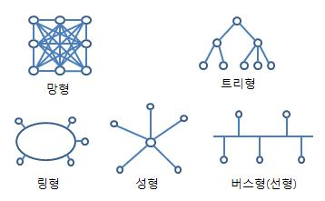

### Internet

- 컴퓨터로 연결하여 TCP / IP 통신 프로토콜을 이용해서 정보를 주고받는 컴퓨터 네트워크
- '네트워크의 네트워크' 구현하여 모든 컴퓨터를 하나의 통신망 하에 <br/>
	연결하고자 하는 의도로 개발되었다.
- International Network => Inter + Net => Internet
- 인터넷은 `종단 시스템`, `통신망`, `프로토콜`, `주소체계`, `인터넷 접속 제공` 구성됐다.

| 인터넷 구성 요소 | 요소 별 설명             |
| --------- | ------------------- |
| 종단 시스템    | 호스트, 서버, 통신 링크, 처리량 |
| 통신망       | LAN, WLAN, WAN      |
| 프로토콜      | IP, TCP, UDP        |
| 주소 체계     | IP 주소, DNS 방식       |
| 인터넷 접속 제공 | ISP, URL, 웹 브라우저    |

---
### 종단 시스템

- 사용자 Host, 서버, 통신 링크, 처리량 등으로 구성됐다.

| 구성    | 설명                                                          |
| ----- | ----------------------------------------------------------- |
| 호스트   | 컴퓨터 네트워크에 연결된 컴퓨터나 기타 장치                                    |
| 서버    | 클라이언트에게 네트워크를 통해 정보나 서비스를 제공하는 컴퓨터                          |
| 통신 링크 | 일반적으로 통신 위성이 지구의 두 지점을 <br/>연결해 주기 위해서 사용하는 여러 종류의 정보 전송 경로 |
| 처리량   | 주어진 시간에 컴퓨터가 처리할 수 있는 데이터의 양                                |

---

### 통신망

#### 1. 근거리 통신망 Local Area Network, LAN

- 네트워크 매체를 이용하여 집, 사무실, 학교 등의 건물과 같은 <br/>
	가까운 지역을 한데 묶는 컴퓨터 네트워크

| 구분        | 설명                                                                                                                                                     |
| --------- | ------------------------------------------------------------------------------------------------------------------------------------------------------ |
| 전송 매체     | 동축 케이블, 광섬유 케이블, 평형 케이블, UTP, 광케이블                                                                                                                     |
| 전송 방식     | **`기저 대역 방식 Baseband`** <br/>- 디지털 신호를 변조하지 않고, 원래 주파수 대역 그대로 전송하는 방식 <br/>**`광대역 방식 Broadband`** <br/>- 데이터 전송 시 여러 개의 변조 신호를 상이한 주파수 대역에서 동시에 보내는 방식 |
| 전송망 구성 형태 | Bus형, Tree형, Ring형, Mesh형,  Star형                                                                                                                      |



| 전송망 형태            | 설명                                                            |
| ----------------- | ------------------------------------------------------------- |
| Bus 형             | 하나의 네트워크 회선에 여러 개의 노드가 멀티 포인트로 연결된 구조                         |
| Tree 형            | 각 노드가 계층적으로 연결되어 있는 구성 형태 <br/>나뭇가지가 사방으로 뻗어 있는 것과 유사한 형태의 구조 |
| Ring 형            | 모든 노드가 하나의 링처럼 되어있는 네트워크 회선에 연결되는 형태                          |
| Mesh 형<br/>(==망형) | 네트워크 상 모든 노드를 상호 연결하는 형태                                      |
| Star 형            | 각 단말 노드가 Hub라는 네트워크 장비에 점 대 점으로 연결된 형태                        |

---

#### 2. 무선랜 통신망 Wireless Local Area Network, WLAN

- 유선 LAN과 무선 단말 사이를 무선 주파수를 이용하여 전송하는 네트워크
- IEEE 802.11
	- 무선 랜, Wi-fi라고 부르는 무선 근거리 통신망을 위한 <br/>
		컴퓨터 무선 네트워크에 사용되는 기술
	- IEEE의 LAN/MAN 표준 위원회 (`IEEE 802`)의 <br/>
		11번째 Working 그룹에서 개발된 표준 기술

| 무선 랜 표준    | 설명                                                                                                                                                                       |
| ---------- | ------------------------------------------------------------------------------------------------------------------------------------------------------------------------ |
| `802.11a`  | 5GHz 대역에서 54Mbps 속도를 제공한다.                                                                                                                                               |
| `802.11b`  | 2.4GHz 대역에서 11Mbps 속도를 제공한다.                                                                                                                                             |
| `802.11e`  | `QOS` 강화를 위해 MAC 지원 기능을 채택 <br/>초고속 서비스(IP 전화, 비디오)에 QOS 제공 <br/><br/>**`QOS, Quality of Service`**: 네트워크 상 흐르는 데이터의 중요도 분류<br/> 우선 순위 정하여 데이터 전송에 특정 수준의 성능을 보장하기 위한 기술 |
| `802.11f`  | AP 간 Roaming 성능을 향상 시킨 표준                                                                                                                                                |
| `802.11g`  | `802.11b` 비슷하지만 속도가 향상된 표준 (22Mbps 이상)                                                                                                                                   |
| `802.11i`  | 무선 랜의 보안 기능을 향상                                                                                                                                                          |
| `802.11h`  | `802.11e`에 전파 간섭 방지하는 기능 추가한 표준                                                                                                                                          |
| `802.11ac` | 다중 단말의 무선 랜 속도는 최소 1Gbit/s <br/>최대 단일 링크 속도는 최소 500Mbit/s까지 가능한 기술                                                                                                       |
| `802.11ad` | 60GHz 대역 사용하여 데이터 전송하는 방식 <br/>대용량 데이터나 무압축 HD 비디오와 같은 높은 동영상 Streaming에 적합한 기술                                                                                          |
| `802.11ax` | 하나의 AP가 다수의 디바이스를 밀도 있게 지원하는 Capacity 최대화 Wifi 기술                                                                                                                        |

---

#### 3. 원거리 통신망 Wide Area Network, WAN

- 국가망, 각 국가의 공중 통신망을 상호 접속 시키는 <br/>
	국제 정보 통신망으로 설계 및 구축, 운용되는 네트워크
	
- 공중 통신망 사업자가 구축하고, 일반 대중 가입자들에게 보편적인 정보통신 서비스 제공

- 거리 제약 X, 다양한 경로를 지나서 정보가 전달되므로 <br/>
	LAN보다 속도가 느리고 에러율 높은 편이다.

- 연결 기술 : 전용 회선 방식, 회선 교환 방식, 패킷 교환 방식이 존재한다.

| 연결 기술                           | 설명                                                                                                                                                                                                                                                                                               |
| ------------------------------- | ------------------------------------------------------------------------------------------------------------------------------------------------------------------------------------------------------------------------------------------------------------------------------------------------ |
| 전용 회선 방식 <br/>Dedicated Line    | 통신 사업자가 사전에 계약을 체결한 송신자와 수신자만 데이터 교환하는 방식 <br/>점대점 프로토콜 (PPP), HDLC, SDLC, HNAS 프로토콜에 사용된다.                                                                                                                                                                                                      |
| 회선 교환 방식 <br/>Circuit Switching | 물리적 전용 선 활용, 데이터 전달 경로가 정해진 후 <br/>동일한 경로로만 데이터가 전달되는 방식 <br/><br/>데이터를 동시에 전송할 수 있는 양을 의미하는 <br/>대역폭이 고정, 안정적인 전송률 확보 가능<br/><br/>점대점 프로토콜, ISDN 프로토콜에 사용된다.                                                                                                                                    |
| 패킷 교환 방식 <br/>Packet Switching  | 전체 메시지를 각 노드가 수용할 수 있는 크기로 잘라서 보내는 방식 <br/>`X25`, 프레임 릴레이 프로토콜에 사용된다. <br/><br/>`데이터 그램`, `가상회선` 방식 존재한다. <br/><br/>**`데이터 그램 Datagram 방식`**: 연결 경로를 확립하지 않고 <br/>각 Packet을 순서에 무관하게 독립적으로 전송하는 방식 <br/>**`가상 회선 Virtual Circuit 방식`**: Packet 전송 전, <br/>송/수신 Station 간의 논리적인 통신 경로를 미리 설정하는 방식 |

---

### Transport Control Protocol, TCP

- 전송 계층에 위치하면서 근거리 통신망 (LAN)이나 Intranet <br/>
	인터넷에 연결된 컴퓨터에서 실행되는 프로그램 간에 <br/>
	일련의 `옥텟 Octet`을 안정적으로, 순서대로, 에러 없이 <br/>
	교환할 수 있게 해주는 Protocol

```
옥텟 Octet
- 8개의 bit가 하나로 모인 것
- 초기의 컴퓨터는 1 byte == 8 bit가 성립하지 않는 경우도 있었기 때문에
  8 bit를 명확하게 정의하기 위해서 옥텟이라는 용어를 사용했었다.
- 그러나 현재는 byte와 같은 의미가 되버렸기 때문에
  8 bit를 의미하는 옥텟은 일반적으로 사용되지는 않는다.
```

- 기본 Header : 20 byte, 최대 60byte까지 확장 가능
- TCP는 `순서 제어`, `오류 제어`, `흐름 제어` 기능을 제공한다.
- TCP는 Internet Protocol Suite의 핵심 프로토콜 중 하나 <br/>
	IP와 함께 '**TCP/IP**'라는 명칭으로 사용된다.
- TCP는 Full Duplex 방식 (전 이중 방식)의 양방향 가상 회선을 제공하고 <br/>
	전송 데이터와 응답 데이터를 함께 전송할 수 있다.

- ▼ **TCP의 특징**

- **신뢰성 보장**
	- Packet 손실, 중복, 순서 바뀜 등의 문제가 없도록 보장
	- 하위 계층인 IP 계층의 신뢰성이 없는 서비스를 보완, 신뢰성 제공함
	- 신뢰성 있는 Stream 전송 기능을 제공한다.

- **연결 지향적**
	- 같은 전송 계층의 `UDP`가 비 연결성인 것과는 반대로 <br/>
		TCP는 연결 지향적이다.
	- 양 단 간, 애플리케이션/프로세스는 TCP가 제공하는 연결성 회선을 통해서 <br/>
		서로 간의 통신을 진행한다.
	- 신뢰성 있는 연결 지향형 전달 서비스

- **흐름 제어 Flow Control**
	- TCP는 흐름 제어 기능을 활용해서 <br/>
		송신 전송률 및 수신 처리율 속도를 일치 시킨다.

- **혼합 제어 Congestion Control**
	- 네트워크가 혼잡하다고 판단되면 <br/>
		혼합 제어 기법을 사용해서 송신율을 감속한다.

---

### User Diagram Protocol, UDP

- 비 연결성, 신뢰성 없음
- 순서화되지 않은 데이터 그램 서비스를 제공하는 전송 계층의 통신 프로토콜

- **▼ UDP 특징**

- **비연결성 & 비신뢰성** 
	- 데이터그램 지향의 전송 계층용 프로토콜 <br/>
		(논리적인 가상 회선 연결이 필요 없다.)
	- 메시지가 제대로 도착 했는지 여부를 확인하지 않음
	- 검사 합을 제외한 특별한 오류 검출 및 제어 없음 <br/>
		(오류 제어 거의 없는 수준)

- **순서화되지 않은 데이터그램 서비스 제공**
	- 수신된 메시지의 순서를 맞추지 않는다.
	- 흐름 제어를 위한 Feedback 제공하지 않음
	
- **실시간 응용 및 멀티캐스팅 가능**
	- 빠른 요청과 응답이 필요한 실시간 응용에 적합함.
	- 여러 다수 지점에 전송이 가능하다.

- **단순한 Header**
	- Header : 고정 크기의 8 byte만 사용 (TCP = 20 byte)
	- Header 처리에 시간과 노력을 필요하지 않는다.

---

### Internet Protocol, IP

- [IP](IP.md)