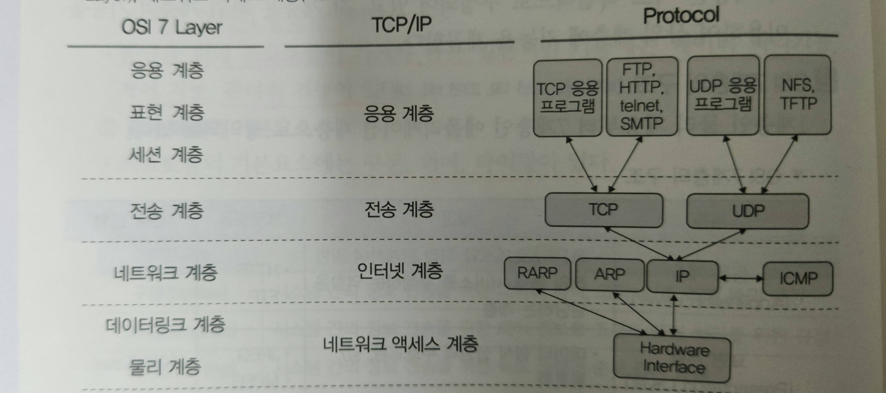
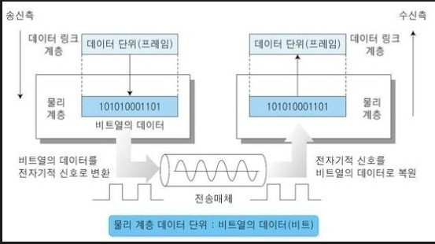
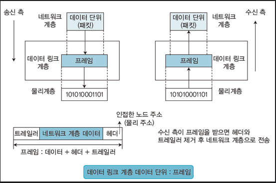
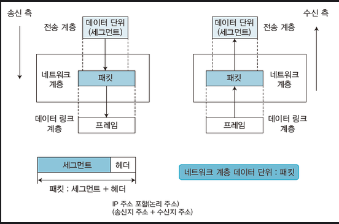
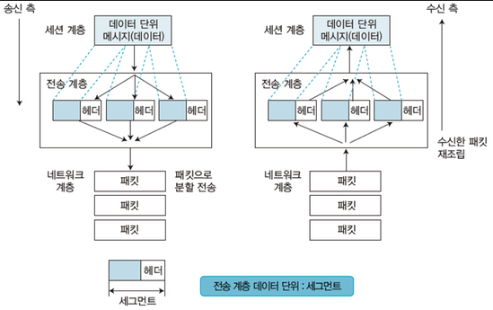
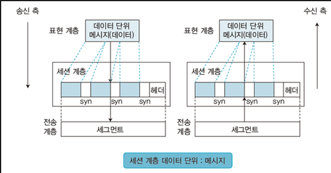
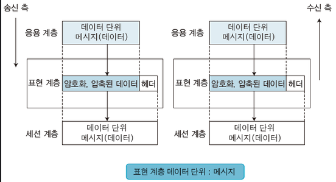
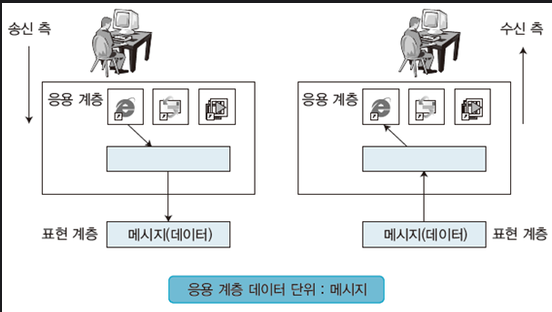

### OSI 7 계층 OSI 7 Layer

- OSI = Open System Interconnection
- 국제 표준화 기구인 ISO에서 개발한 컴퓨터 네트워크 프로토콜 디자인과 <br/>
	통신을 계층으로 나눠서 설명한 개방형 시스템 상호 연결 모델을 말한다.
- 각 계층은 서로 독립적으로 구성되어 있고, 각 계층은 하위 계층의 기능을 이용하여 <br/>
	상위 계층에 기능을 제공한다.
- 1 계층 **Physical Layer 물리 계층** ~ 7 계층 **Application Layer 응용 계층**으로 정의되어 있다.

| 계층                             | 설명                                                                                 | 프로토콜             |
| ------------------------------ | ---------------------------------------------------------------------------------- | ---------------- |
| Application Layer <br/>응용 계층   | 응용 프로세스와 직접 관계 하여 <br/>일반적인 응용 서비스를 수행하는 역할 담당하는 계층 <br/>전송 단위: `data`             | HTTP <br/>FTP    |
| Presentation Layer <br/>표현 계층  | 데이터 형식의 설정과 부호 교환 <br/>암호화 및 복호화 <br/>전송 단위: `data`                                | JPEG <br/>MPEG   |
| Session Layer <br/>세션 계층       | 송/수신 간 연결 접속 및 동기 제어 (Sync) <br/>전송 단위: `data`                                     | RPC <br/>NetBIOS |
| Transport Layer <br/>전송 계층     | 송/수신 간 신뢰성 있는 통신 보장 <br/>전송 단위: `Segment`                                          | TCP <br/>UDP     |
| Network Layer <br/>네트워크 계층     | 단말 간 데이터 전송을 위한 최적화된 경로 제공 <br/>전송 단위: `Packet`                                    | IP <br/>ICMP     |
| Data Link Layer <br/>데이터 링크 계층 | 오류, 흐름을 제어하여 신뢰성 있는 데이터 전송 <br/>전송 단위: `Frame`                                     | HDLC <br/>PPP    |
| Physical Layer <br/>물리 계층      | 실제 장비들을 연결하기 위한 연결 장치 <br/>`0`, `1`의 비트 정보를 회선에 보내기 위한 전기적 신호 변환 <br/>전송 단위: `Bit` | RS-232C          |

---

### TCP/IP 프로토콜



- `TCP/IP` : TCP, IP 프로토콜만 지칭하는 것이 아니라 <br/>
	UDP, ICMP 등 관련된 프로토콜을 통칭한다.
* TCP, UDP로 구분되는 프로토콜은 `전송 계층`에서 <br/>
	`응용 계층`과 `인터넷 계층` 사이의 통신을 담당한다.
- TCP/IP Protocol은 `응용 계층 - 전송 계층 - 인터넷 계층 - 네트워크 엑세스 계층` 구성됐다.

- `네트워크 엑세스 계층` => `OSI 7 Layer`에서 물리 계층과 데이터 링크 계층에 대응
- `인터넷 계층` => 네트워크 계층에 대응
- `전송 계층` => 전송 계층에 대응한다.
- `응용 계층` => `세션 계층`, `표현 계층`, `응용 계층`에 대응한다.

---

### 1 계층 / Physical Layer 물리 계층



* 실제 장치들을 연결하기 위해 필요한 전기적, 믈리적 세부 사항들을 정의하는 계층
* 통신 채널을 통해 전송되는 사용자 장치의 디지털 데이터를 <br/>
	이에 상응하는 신호들로 변조 및 복조한다.
- OSI 계층을 타고 전달된 데이터를 전기적인 신호로 변환해서 통신을 수행
- 데이터 링크 개체 간 비트 전송을 위한 물리적 연결 설정, 유지, 해제하기 위한 수단 제공

- 물리 계층 프로토콜 : `RS-232`
	- **`RS-232`**: 1960년에 도입된 표준, PC와 음향 커플러, 모뎀 등을 접속하는 <br/>
			 직렬 방식의 인터페이스
			 
- 물리 계층 장비 : `Hub`, `Repeater`

| 장비         | 설명                                                                      |
| ---------- | ----------------------------------------------------------------------- |
| `Hub`      | 여러 대의 컴퓨터를 연결하여 네트워크로 보내거나 <br/>하나의 네트워크로 수신된 정보를 여러 대의 컴퓨터로 송신하기 위한 장비 |
| `Repeater` | 디지털 신호를 증폭시키는 역할을 하며 <br/>신호가 약해지지 않고 컴퓨터로 수신되도록 하는 장비                  |

---

### 2 계층 / Data Link Layer 데이터 링크 계층



- 링크의 설정과 유지 및 종료를 담당하며 <br/>
	물리적 연결을 이용해서 신뢰성 있는 정보를 전송하기 위해서 <br/>
	`동기화`, `오류 제어`, `흐름 제어`, `회선 제어` 기능을 수행하는 계층

- 네트워크 계층에 데이터를 전달하고 
- 물리 계층에서 발생할 수 있는 오류를 탐지하고 수정하는 기능 제공한다.

- 데이터 링크 계층은 인접한 2개의 통신 시스템 간에 신뢰성 있는 효율적인 데이터 전송한다.
- 시스템 간 오류 없는 데이터 전송을 위해 상위 계층에서 받은 Packet, Frame 변환 <br/>
	물리 계층으로 전송한다.
- Header의 끝에는 `물리 주소 정보`가 들어있으며, 트레일러에는 `오류 검출 비트` 포함한다.
- 데이터 링크 계층은 MAC 주소를 이용하여 통신한다.

- 프로토콜 : `HDLC`, `PPP`, `LLC`, `Frame Relay`, `ATM`
- 장비 : `Switch`, `Bridge`

---
#### 데이터 링크 계층 오류 제어

- **오류 제어**
	- 데이터 전송 시 감쇠, 왜곡, 잡음에 의해 생성된 오류를 검출, 정정하는 기능
	- 데이터 전송의 신뢰성을 위해 반드시 필요한 기능

- 오류 제어 방식으로 **전진 오류 수정**, **후진 오류 수정** 두 가지 방식이 존재한다.

| 오류 제어 방식                                           | 설명                                                                                                                                      |
| -------------------------------------------------- | --------------------------------------------------------------------------------------------------------------------------------------- |
| 전진 (순방향) 오류 수정 <br/>Forward Error Correction, FEC  | 데이터 전송 과정에서 발생한 오류를 검출하여<br/>검출된 오류를 재전송 요구 없이 스스로 수정하는 방식 <br/><br/>오류 검출과 수정을 위한 방식으로는 <br/>`해밍 코드 방식`, `상승 코드 방식`이 존재한다.             |
| 후진 (역방향) 오류 수정 <br/>Backward Error Correction, BEC | 데이터 전송 과정에서 오류가 발생하면 <br/>송신 측에 재전송을 요구하는 방식 <br/><br/>`패리티 검사`, `CRC`, `블록합 검사` 사용하여 오류 검출, <br/>오류 제어는 **자동 반복 요청 (ARQ)** 에 의해 이루어진다. |

```
1. 해밍 코드 방식
- 수신 측에서 오류가 발생한 비트를 찾아 재전송 요구하지 않고
- 자신이 직접 오류를 수정하는 방식
- 1 bit의 오류 수정이 가능하다.

2. 상승 코드 방식
- 1개의 오류 비트 수정 가능한 해밍과는 달리
- 여러 개의 비트의 오류가 있다고 해도, 한곗값, 순차적 Decoding 이용하여
  모두 수정할 수 있는 방식

3. 패리티 검사 Parity Check
- 7 ~ 8개의 bit로 구성된 전송 문자에 패리티 비트 추가하여
- 오류를 검출하는 방식

4. CRC, Cycle Red undancy Check, 순환잉여검사
- 다항식을 통해 산출된 CRC 값을 토대로 오류를 검사하는 방식
- 집단 오류를 해결하기 위한 방식

5. 블록합 검사 Block Sum Check
- Frame의 모든 문자로부터 계산되는 잉여 Parity bit들을 사용하는
- 이차원(가로/세로) 패리티 검사 방식이다.
```

- 자동 반복 요청, Automatic Repeat reQuest, ARQ는 에러가 발생할 경우 <br/>
	자동으로 재 전송을 요구하는 방식
	
- `Stop-and-Wait ARQ`, `Go-Back-N ARQ`, `Selective Repeat ARQ`, `Adaptive ARQ` 방식이 존재한다.

| ARQ 방식                               | 설명                                                                                                                                                                                                                                                                                        |
| ------------------------------------ | ----------------------------------------------------------------------------------------------------------------------------------------------------------------------------------------------------------------------------------------------------------------------------------------- |
| `Stop-and-Wait ARQ` <br/>정지 - 대기 ARQ | 1개의 프레임 전송, 수신 측으로부터 ACK, NAK 신호를 수신할 때까지 <br/>정보 전송을 중지하고 기다리는 방식 <br/><br/>송신 측이 수신 측으로부터 ACk 받으면 다음 프레임 전송/ NAK면 재전송 한다. <br/><br/>데이터 프레임의 정확한 수신 여부를 매번 확인하면서 <br/>다음 프레임 전송해나가는 간단한 오류 제어 방식 <br/><br/>구현 간단하고 송신 측에서 최대 프레임 크기의 버퍼가 1개만 있어도 된다. <br/><br/>전송 시간이 긴 경우 전송 효율이 저하된다. |
| `Go-Back-N ARQ` <br/>연속적 ARQ         | 데이터 프레임을 연속적으로 전송하는 과정에서 NAK 수신하면 <br/>오류가 발생한 프레임 이후에 전송된 모든 데이터 프레임을 재전송하는 방식                                                                                                                                                                                                           |
| `Selective Repeat ARQ` <br/>선택적 ARQ  | 연속적으로 데이터 프레임 전송, 에러가 발생한 프레임만 재전송하는 방식                                                                                                                                                                                                                                                   |
| `Adaptive ARQ` <br/>적응적 ARQ          | 전송 효율을 최대한 높이려고 <br/>데이터 블록의 깊이를 동적으로 변경, 전송하는 방식                                                                                                                                                                                                                                         |

---

### 3 계층 / Network Layer 네트워크 계층



- 다양한 길이의 Packet을 네트워크를 통해 전송하고 <br/>
	그 과정에서 전송 계층이 요구하는 서비스 품질을 위한 수단을 제공하는 계층

- 네트워크 계층은 `라우팅`, `패킷 포워딩`, `인터 네트워킹` 등을 수행함.

- Packet에 발신지와 목적지의 논리 주소를 추가하고 <br/>
	Packet을 발신지에서 최종 목적지까지 전달하는 역할을 수행한다.
- 이때 Packet을 네트워크를 통해 발신지에서 목적지까지 전달하기 위해서 <br/>
	Routing Protocol 사용하여 최적의 경로를 선택한다.
- 데이터 전송할 주소를 확인한 후 전송 계층으로 전달한다.
- 프로토콜: `IP`, `ARP`, `RARP`, `ICMP`, `IGMP`, `Routing Protocol`

| 프로토콜                                             | 설명                                                                                                                                                                                                                                                                  |
| ------------------------------------------------ | ------------------------------------------------------------------------------------------------------------------------------------------------------------------------------------------------------------------------------------------------------------------- |
| **IP** <br/>Internet Protocol                    | 송/수신 간의 Packet 단위로 데이터를 교환하는 <br/>네트워크에서 정보를 주고 받는데 사용하는 통신 규약                                                                                                                                                                                                      |
| **ARP** <br/>Address Resolution Protocol         | IP 네트워크 상에서 IP 주소를 MAC 주소로 변환하는 프로토콜 <br/>(MAC 주소 == 물리 주소)                                                                                                                                                                                                         |
| **RARP** <br/>Reverse ARP                        | IP Host가 자신의 MAC은 알지만 IP 주소를 모를 때 <br/>서버로부터 IP 주소를 요청하기 위해서 사용하는 프로토콜                                                                                                                                                                                              |
| **ICMP** <br/>Internet Control Message Protocol  | IP Packet 처리 시 발생되는 문제를 알려주는 프로토콜 <br/>메시지 형식: 8 byte header, 가변 길이 데이터 영역 분리 <br/><br/>수신자 도달 불가 메시지는 수신자 or 서비스에 <br/>도달할 수 없는 host 통지하는데 사용 <br/><br/>ICMP 사용해서 `ping` Utility 구현 <br/>(`ping` : IP 네트워크 통해 특정 Host가 도달할 수 있는 지<br/> 여부를 테스트하는데 쓰이는 컴퓨터 네트워크 도구) |
| **IGMP** <br/>Internet Group Management Protocol | Host 컴퓨터와 인접 Router가 <br/>`멀티캐스트 그룹 맴버쉽` 구성하는데 사용하는 통신 프로토콜<br/><br/>화상회의, IPTV에서 사용되는 프로토콜 <br/>기능으로는 그룹 가입, 맴버쉽 감시, 응답, 탈퇴 등이 있다.                                                                                                                                 |
| Routing Protocol                                 | Router 간 통신 방식을 규정하는 통신 규약 <br/>경로 설정 통해 원하는 목적지까지 지정된 데이터를 안전하게 전달 <br/><br/>내부 Routing Protocol : `RIP`, `OSPF` <br/>외부 Routing Protocol: `EGP`, `BGP`                                                                                                            |


- 네트워크 계층 장비: **`Router`**
- **Router**
	- 서로 다른 네트워크 대역에 있는 Host's <br/>
		상호 간에 통신할 수 있도록 해주는 네트워크 장비
	- Packet의 위치를 추출하여, 해당 위치에 대한 최적 경로 지정 <br/>
		해당 경로를 따라 Data Packet 다음 장치로 전송하는 장비
	- Routing Protocol은 경로 설정을 해서 원하는 목적지까지 <br/>
		지정한 데이터가 안전하게 전달될 수 있게 하는 Protocol

---

### 4 계층 / Transport Layer 전송 계층



- 상위 계층들이 데이터 전달의 유효성이나 효율성을 생각하지 않도록 해주면서 <br/>
	종단 간의 사용자들에게 신뢰성 있는 데이터를 전달하는 계층
- 순차 번호 기반의 오류 제어 방식 사용, 종단 간 통신을 다루는 최하위 계층
- 종단 간 신뢰성 있고 효율적인 데이터를 전송한다.

- `TCP`, `UDP` 구성됐고, 오류 제어와 흐름 제어, 혼잡 제어 등을 담당
- 두 시스템 간 신뢰성 있는 데이터를 전송한다.

- 프로토콜: `TCP`, `UDP`

| 프로토콜                                       | 설명                                                                                                                  |
| ------------------------------------------ | ------------------------------------------------------------------------------------------------------------------- |
| **TCP** <br/>Transmission Control Protocol | 전송 계층에 위치하면서, 근거리 통신망이나 Intranet <br/>인터넷에 연결된 컴퓨터에서 실행되는 프로그램 간에 <br/>일련의 옥텟을 안정적으로, 순서대로, 에러 없이 교환할 수 있게 해주는 프로토콜 |
| **UDP** <br/>User Datagram Protocol        | 비 연결성, 신뢰성 없으며 순서화되지 않은 <br/>데이터 그램 서비스를 제공하는 전송 계층의 프로토콜                                                           |

---

### 5 계층 / Session Layer 세션 계층



- 응용 프로그램 간의 대화를 유지하기 위한 구조를 제공하고 <br/>
	이를 처리하기 위해 프로세스들의 논리적인 연결을 담당하는 계층

- 통신 중 연결이 끊어지지 않도록 유지해주는 역할을 수행하기 위해 <br/>
	TCP/IP 세션 연결의 설정, 해제, 세션 메시지 전송 등의 기능을 수행한다.
- 통신을 하기 위한 세션을 확립하고, 유지 및 중단을 수행한다.
- 통신하는 사용자들을 Synchronous해주고, 오류 복구 명령들을 일괄 처리한다.

- 프로토콜: `RPC`, `NetBIOS`

| 프로토콜                                      | 설명                                                                                                 |
| ----------------------------------------- | -------------------------------------------------------------------------------------------------- |
| **RPC** <br/>Remote Procedure Call        | 원격 프로시저 호출이라고 불린다. <br/>별도의 원격 제어 위한 코딩 없이 다른 주소 공간에서 <br/>함수나 프로시저를 실행할 수 있는 프로세스 간 통신에 사용되는 프로토콜 |
| **NetBIOS** <br/>Network Basic I/O System | 응용 계층의 애플리케이션 프로그램에게 API 제공하여 <br/>상호 통신할 수 있도록 해주는 프로토콜                                           |


---

### 6 계층 / Presentation Layer 표현 계층



- 애플리케이션이 다루는 정보를 통신에 알맞은 형태로 만들거나
- 하위 계층에서 온 데이터를 사용자가 이해할 수 있는 형태로 변환하는 역할을 담당하는 계층

- 수신자 장치에서 적합한 APP 사용하여 응용 계층 데이터의 부호화, 변환 수행 통해 <br/>
	송신 장치로부터 온 데이터를 해석한다.
	
- 데이터의 효율과 보안을 위해 압축 및 암호화 수행
- 전송을 위한 포맷으로 변경을 수행한다.

- 프로토콜: `JPEG`, `MPEG`

| 프로토콜     | 설명                                |
| -------- | --------------------------------- |
| **JPEG** | 이미지를 위해 만들어진 표준 규격                |
| **MPEG** | 비디오, 오디오와 같은 멀티미디어를 위해 만들어진 표준 규격 |

***

### 7 계층 / Application Layer 응용 계층



- 응용 프로세스와 직접 관계되어, 일반적인 응용 서비스 수행하는 역할 담당하는 계층
- 응용 프로세스가 개방된 형태로 다양한 범주의 정보처리 기능을 수행할 수 있도록 <br/>
	여러 프로토콜 개체에 대하여 사용자 인터페이스를 제공한다.
* 응용 프로세스 간 `정보 교환`, `파일 전송` 등의 서비스를 제공한다.


- 프로토콜: `HTTP`, `FTP`, `SMTP`, `POP3`, `IMAP`, `Telnet`, `SSH`, `SNMP`, `DHCP`

| 프로토콜                                     | 설명                                                                                |
| ---------------------------------------- | --------------------------------------------------------------------------------- |
| **HTTP**<br/>HyperText Transfer Protocol | 텍스트 기반의 통신 규약 <br/>인터넷에서 데이터를 주고 받을 수 있는 프로토콜 <br/>HyperText 빠르게 교환하기 위한 Protocol |
| **FTP**<br/>File Transfer Protocol       | TCP/IP Protocol 가지고 서버, 클라이언트 사이에 <br/>파일을 전송하기 위한 프로토콜                           |

- 먼저 `HTTP`, `FTP`만 우선적으로 정리하고 <br/>
	나머지 Protocol에 대한 것은 정리를 임시 보류 처리하였음.
	