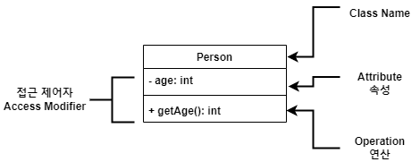
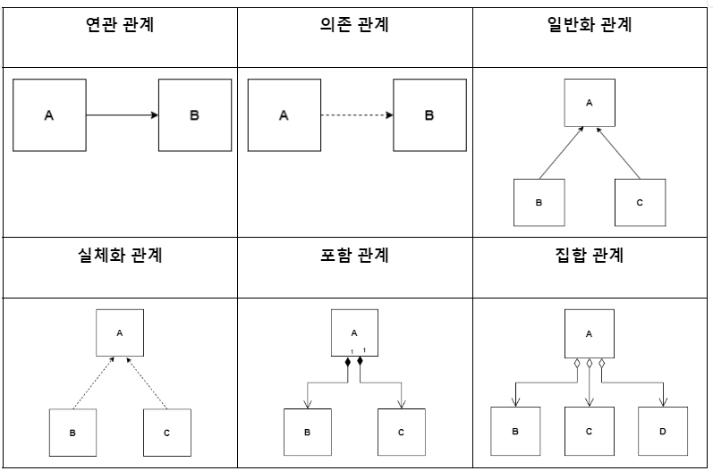

### Unified Modeling Language, UML

- 객체 지향 개발 과정에서 산출물을 (명세 / 시각 / 문서)화를 할 때 사용되는  
	모델링 기술과 방법론을 통합해서 만든 표준화된 범용 모델링 언어
- UML은 개발 과정에서 개발자와 고객 혹은 다른 개발자 등의  
	다양한 이해 관계자와의 의사소통을 원활하게 하기 위한 도구

| UML 특징 | 의미                                                               |
| ------ | ---------------------------------------------------------------- |
| 가시화 언어 | 개념 모델 작성 시 오류가 적고 의사 소통이 용이하다                                    |
| 구축 언어  | 다양한 언어로 실행 시스템의 예측 가능  UML을 소스 코드로 변환하여 구축 가능, 역 변환하여 역공학 가능 |
| 명세화 언어 | 정확한 모델 제시, 완전한 모델 작성 가능                                          |
| 문서화 언어 | 시스템에 대한 평가 및 의사 소통의 문서                                           |

 

- UML은 `사물 Things`, `관계 Relationship`, `다이어그램 Diagram` 구성됐다.

| UML 구성                   | 설명                                                                           |
| ------------------------ | ---------------------------------------------------------------------------- |
| `사물`  `Things`       | 추상적인 개념, 주제를 나타내는 요소  '명사', '동사'에 가까운 개념                                 |
| `관계`  `Relationship` | 사물의 의미를 확장, 명확히 하는 요소  사물과 사물을 연결하여 관계를 표현하는 요소  '형용사', '부사'에 가까운 개념 |
| `다이어그램`  `Diagram`   | 사물과 관계를 모아 그림으로 표현한 형태  형식, 목적에 따라 9가지로 정의된다.                            |

---

### UML Diagram

- UML 다이어그램은 구분에 따라 정적 다이어그램과 동적 다이어그램으로 나뉘어진다.
- Component, 배치 다이어그램은 구현 단계에서 사용되는 다이어그램이다.

 

- **정적 다이어그램 Static Diagram / 구조적 다이어그램 Structural Diagram**

| 다이어그램                               | 설명                                                                                                                    |
| ----------------------------------- | --------------------------------------------------------------------------------------------------------------------- |
| `class`                             | 시스템 내 `class`의 정적 구조 표현  `Attribute 속성`, `Behavior 동작`으로 구성됐다.                                                    |
| `Object`                            | `class`에 속한 객체, Instance를 특정 시점의 객체와 객체 사이의 관계로 표현  객체 Instance 나타내는 대신, 실제 `class` 사용  연관된 모든 Instance 표현한다. |
| `Component`                         | `Code Component` 기반의 물리적 구조 표현  실질적 프로그래밍 작업에 사용된다.                                                               |
| `Deployment` `배치`               | `Component` 사이의 종속성 표현  결과물, 프로세스, 컴포넌트 등 물리적 요소들의 위치 표현                                                          |
| `Composite Structure`  `복합체 구조` | 클래스, 컴포넌트가 복합 구조를 갖는 경우  그 내부 구조를 표현함.                                                                            |
| `Package`                           | `Usecase`나 클래스 등의 모델 요소들을 그룹화한 패키지들의 관계 표현                                                                            |

 

---

**동적 다이어그램 Dynamic Diagram / 행위적 다이어그램 Behavioral Diagram**

| 다이어그램           | 설명                                                                                                                                                                                                                                            |
| --------------- | --------------------------------------------------------------------------------------------------------------------------------------------------------------------------------------------------------------------------------------------- |
| `Usecase`       | 사용자 관점에서 시스템의 활동을 표현                                                                                                                                                                                                                          |
| `Sequence`      | 객체 간 상호 작용을 메시지 흐름으로 표현  객체 사이 메시지를 보내는 시간을 표현  Interaction Digram (r교류 D)의 한 종류로 볼 수도 있음.                                                                                                                                            |
| `Communication` | 시퀀스 다이어그램과 같이 동작에 참여하는 객체들의 주고 받는 메시지 표현  메시지 뿐만 아니라 객체 간의 연관까지 표현                                                                                                                                                                        |
| `state`         | 하나의 객체가 자신이 속한 Class의 상태 변화 혹은 다른 객체와의  상호 작용에 따라 상태가 어떻게 변화하는 지 표현   모든 가능한 상태와 전이 표현   상태의 변화를 일으키는 조건, 그 조건이 `State` 변화시킬 때  시스템이 취하는 행동을 제시해야 한다.   상태도는 유한 상태 기계에서 상태, 상태 천이를 표현하기 위해  도식화해서 표현하는 그림 |
| `Activity`      | 시스템이 어떤 기능을 수행하는 지를 객체의 처리 로직이나  조건에 따른 처리의 흐름을 순서대로 표현  활동의 순서대로 흐름을 표현                                                                                                                                                              |
| `Timing`        | 객체 상태 변화와 시간 제약을 명시적으로 표현                                                                                                                                                                                                                     |

---

#### Class Diagram

- 객체 지향 모델링 시 클래스의 속성 및 연산과 클래스 간의 정적인 관계를 표현한 다이어그램
- Class 이름, 속성, 연산, 접근 제어자로 구성됐다.

| 구성 요소           | 설명                                                                                                                                                                                                      |
| --------------- | ------------------------------------------------------------------------------------------------------------------------------------------------------------------------------------------------------- |
| Class Name      | 클래스의 이름                                                                                                                                                                                                 |
| Attribute       | 클래스의 특징에 이름을 부여                                                                                                                                                                                         |
| Operation       | 클래스에 속하는 객체에 적용될 메서드  클래스의 동작, UML에서는 동작에 대한 인터페이스 지칭함.                                                                                                                                             |
| Access Modifier | 클래스에 접근할 수 있는 정도를 표현  **접근 제어자 목록**  `-`: 클래스 내부 접근만 허용 (`private`)  `+`: 클래스 외부 접근 허용 (`public`)   `#`: 동일 패키지 및 파생 클래스에서 접근 가능 (`protected`)  `~`: 동일 패키지 클래스에서 접근 가능 (`default`) |

---
#### Usecase Diagram

- 시스템이 제공하고 있는 기능 및 그와 관련된 외부 요소를  
	사용자 관점에서 표현하는 다이어그램
- `Usecase`, `Actor`, `System` 세 가지로 구성됐다.

| 구성        | 설명                                                                      |
| --------- | ----------------------------------------------------------------------- |
| `Usecase` | 코드로 구현할 수 있는 최소 단위  시스템이 제공해야 하는 서비스 Actor가 시스템을 통해 수행하는 일련의 행위 |
| `Actor`   | 사용자가 시스템에 대해 수행하는 역할  시스템과 상호 작용하는 사람 또는 사물                         |
| `System`  | 전체 시스템의 영역을 표현                                                          |

---

#### Sequence Diagram

- 객체 간 상호 작용을 메시지 흐름으로 표현한 다이어그램
- `객체`, `생명선`, `실행`, `메시지`로 구성됐다.

| 구성                     | 설명                                                                                  |
| ---------------------- | ----------------------------------------------------------------------------------- |
| `Object`  `객체`     | 위쪽에 표시, 아래로 `Lifeline` 가진다.  사각형 내부에 밑줄 친 이름으로 표시                               |
| `Lifeline`  `생명선`  | 객체로부터 뻗어나가는 점선 실제 시간이 흐름에 따라  객체의 LifeCycle 동안 발생하는 Event 표시                |
| `Activation`  `실행` | Operation(함수)이 실행되는 시간 의미  직사각형 길이에 비례해서, 함수 실행 시간 길어짐                          |
| `Message` `메시지`    | 객체 간 상호 작용은 메시지로 이뤄진다.   한 객체에서 다른 객체로의 메시지를 전달  전달 받은 객체의 Operation 수행 |

---

### UML의 관계 Relationship

 

- UML 관계 == 사물과 사물 사이의 연관성을 표현한 것
- UML의 관계는 그 형태에 따라 아래 여섯 가지로 구분할 수 있다.
- `연관 관계`, `의존 관계`, `일반화 관계`, `실체화 관계`, `포함 관계`, `집합 관계`

| 구분                            | 설명                                                                                                                                                              |
| ----------------------------- | --------------------------------------------------------------------------------------------------------------------------------------------------------------- |
| `연관 관계`  `Association`    | 2개 이상의 사물이 서로 관련된 상태를 표현하는 관계  사물 사이를 실선으로 연결, 방향성은 화살표로 표현  서로에게 영향을 주는 양방향 관계라면 화살표 생략, 실선 표기                                                         |
| `의존 관계` `Dependency`      | 사물 사이에 서로 연관 있으나, 필요에 따라 서로에게 영향을 주는  짧은 시간 동안만 연관을 유지하는 상태를 표현하는 관계  사물의 변화가 다른 사물에게도 영향 미치는 관계  한 클래스가 다른 클래스를 오퍼레이션의 매개변수로  사용하는 경우에 나타나는 관계 |
| `일반화 관계` `Generalization` | 하나의 사물이 다른 사물에 비해 더 일반적인지  구체적인지를 표현하는 관계  일반적인 개념 == 부모 (상위), 구체적인 개념 == 자식 (하위)  하위 사물에서 상위 사물 쪽으로 속이 빈 화살표 연결하여 표현                               |
| `실체화 관계` `Realization`    | 한 객체가 다른 객체에 오퍼레이션을 수행하도록 지정하는 관계  사물에서 기능 쪽으로 속이 빈 점선 화살표 연결하여 표현                                                                                          |
| `포함 관계` `Composition`     | 집합 관계의 특수한 형태, 포함하는 사물의 변화가  포함되는 사물에 영향을 미치는 관계  포함되는 쪽에서 포함하는 쪽으로 속이 채워진 마름모 연결하여 표현                                                                  |
| `집합 관계` `Aggregation`     | 하나의 사물이 다른 사물에 포함된 관계  포함되는 쪽에서 포함하는 쪽으로 속이 빈 마름모 연결하여 표현함                                                                                                  |

---

