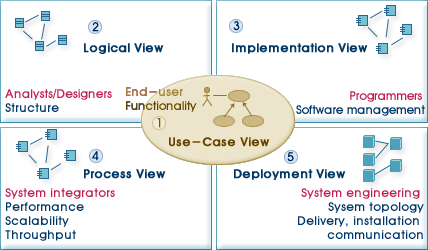
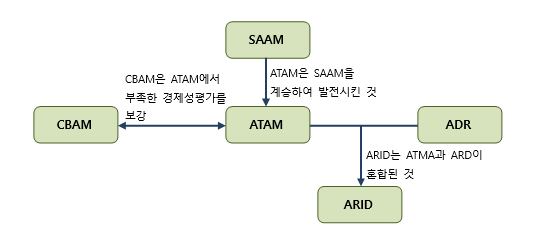
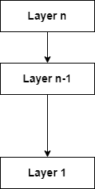
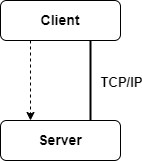
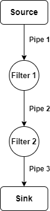
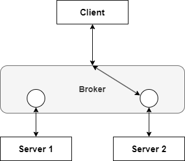
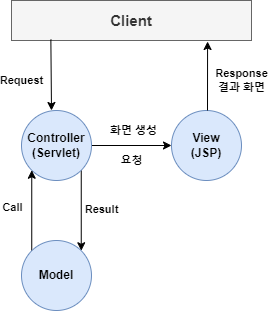
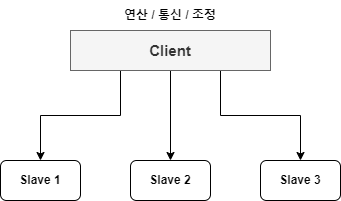
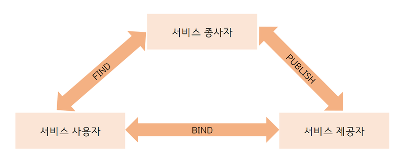

### 소프트웨어 아키텍처 Software Architecture ☆☆☆

- 여러가지 SW 구성 요소와 그 구성 요소가 가진 특성 중에서 외부에 드러나는 특성  
	그리고 구성 요소 간 관계를 표현하는 시스템의 구조
- SW 설계하고 전개하기 위한 지침과 원칙

- 소프트웨어 아키텍처는 주요 이해자 간의 관점 조율을 통한 시스템을 최적화한다.
- 아키텍처는 시스템의 비 기능적인 요소에 집중해서 만들어지고  
	기능적인 요소도 고려한다.

---

### 4+1 View

- SW Architecture 4+1 View
- 4+1 View는 고객의 요구 사항을 정리해 놓은 시나리오를  
	4개의 관점에서 바라보는 소프트웨어 적인 접근 방법

- 4개의 분리된 구조로 구성되는 아키텍처 개념을 제시하고  
	4개의 구조가 서로 충돌하지 않는 지, 시스템의 요구 사항을 충족하는 지  
	여부를 증명하기 위해 검증 방법으로 Usecase를 사용한 것

| 구성 요소                               | 설명                                                                                                                         |
| ----------------------------------- | -------------------------------------------------------------------------------------------------------------------------- |
| `Usecase View`                      | Usecase, 아키텍처를 도출, 설계하여 다른 뷰를 검증하는 데 사용되는 뷰 외부 행위자에 의해 인식되는 시스템 기능 요구 사항을 보여주는 데 초점을 두고 있다.  사용자, 설계자, 개발자, 테스트 관점 |
| `Logical View` `논리 View`        | 시스템의 기능적인 요구 사항이 어떻게 제공되는 지 설명하는 뷰  설계자, 개발자 관점                                                                        |
| `Process View`                      | 시스템의 비 기능적인 속성, 자원의 효율적인 사용  병행 실행, 비동기, 이벤트 처리 등을 표현한 뷰   개발자, 시스템 통합자 관점                                     |
| `Implementation View` `구현 View` | 개발 환경 안에서 정적인 SW 모듈의 구성을 보여주는 뷰  컴포넌트 구조와 의존성 보여주고, 컴포넌트에 관한 부가적인 정보를 정의한다.                                            |
| `Deployment View` `배포 View`     | 컴포넌트가 물리적인 아키텍처에 어떻게 배치되는 가를  Mapping하고 이를 보여주는 뷰   물리적 시스템을 구성하고 있는 각 부분들의  분산 형태와 설치에 초점을 두고 있다.         |

---

 

### SW Architecture 비용 평가 모델

 

- 아키텍처 접근 법이 품질 속성에 미치는 영향을 판단하고  
	아키텍처의 적합성을 평가하는 모델

| 평가 모델                                               | 설명                                                         |
| --------------------------------------------------- | ---------------------------------------------------------- |
| `SAAM` `Software Architecture Analysis Method`  | 변경 용이성과 기능성에 집중 평가가 용이하며  경험이 없는 조직에서도 활용 가능한 비용 평가 모델 |
| `ATAM` `Architecture Trade-off Analysis Method` | `아키텍처 품질 속성` 만족하는지 판단하고  품질 속성들의 이해, 상충관계까지 평가하는 모델    |
| `CBAM` `Cost Benefit Analysis Method`           | `ATAM` 바탕의 시스템 아키텍처 분석 중심  경제적 의사 결정에 대한 요구를 충족하는 모델   |
| `ADR` `Active Design Review`                    | `SW 아키텍처` 구성 요소 간 응집도를 평가하는 모델                             |
| `ARID` `Active Review for Intermediate Designs` | 전체 아키텍처가 아닌, 특정 부분에 대한  품질 요소에 집중하는 비용 평가 모델           |

---

### SW Architecture Pattern ☆☆

- 외부에서 인식할 수 있는 특성이 담긴 SW의 골격이 되는 기본 구조
- SW 설계할 때 참조할 수 있는 전형적인 해결 방식
- 주어진 상황에서 SW 아키텍처에 일반적으로 발생하는 문제점들에 대한  
	일반화되고 재 사용이 가능한 Solution == SW 아키텍처 패턴

---

#### 필요성

- SW 개발 시 상황 별 SW 아키텍처 패턴을 수립 적용하면  
	고객과의 의사소통을 통해서 고객의 요구 사항을 만족시키고  
	SW 개발 생산성과 품질 확보가 가능하다.

- 데이터 중심 아키텍처는 공유 데이터 저장소를 통해 접근자 간 통신이 이뤄진다.  
	따라서 각 접근자의 수정과 확장이 용이하다.

- 이미 검증된 구조로 개발하기 때문에 SW 개발을 안정적으로 수행이 가능하고  
	시스템의 특성을 개발 전에 예측이 가능하다.

- Business Logic만 알고 있다면 SW 아키텍처 패턴을 사용, SW를 쉽게 개발할 수 있다.

---

### SW 아키텍처 패턴 종류

- SW 아키텍처 패턴은 `계층화`, `클라이언트-서버`, `파이프-필터`, `브로커 패턴` 등이 존재한다.

#### 계층화 패턴 Layered Pattern

- 시스템을 계층 Layer 형태로 구분하여 구성하는 아키텍처 패턴
- 각 하위 모듈은 특정한 수준의 추상화를 제공하고  
	각 계층은 다음 상위 계층에 서비스를 제공한다.
* 계층화 패턴은 서로 마주 보는 두 개의 계층 사이에서만 상호 작용이 이루어진다.

---

#### 클라이언트 - 서버 패턴 Client - Server Pattern

- 하나의 서버와 다수의 클라이언트로 구성된 패턴
- 사용자가 클라이언트를 통해서 서버에 서비스를 요청하면  
	서버는 클라이언트에게 서비스를 제공한다.
- 서버는 클라이언트 측의 요청이 올 때까지 대기한다.

---

#### 파이프 - 필터 패턴 Pipe - Filter Pattern

- Data Stream 생성하고 처리하는 시스템에서 사용 가능한 단방향 패턴
- Sub System이 입력 데이터를 받아 처리하고  
	결과를 다음 서브 시스템으로 넘겨주는 과정을 반복한다.
- Filter Component는 재 사용성이 좋고, 추가가 쉽기 때문에 확장이 용이하나  
	필터 간 데이터 이동에서 데이터 변환 Overhead가 발생할 수 있다.

---

#### 브로커 패턴 Broker Pattern

- 분리된 Component들로 이루어진 분산 시스템에서 사용되고  
	이 컴포넌트들은 원격 서비스 실행을 통해 상호 작용이 가능한 패턴
- 브로커 컴포넌트는 컴포넌트 간의 통신을 조정하는 역할을 수행한다.

- 서버는 자신의 기능, 서비스 및 특성을 브로커에게 넘겨주고 Publish  
	클라이언트가 브로커에게 서비스를 요청하면 브로커는 클라이언트를  
	자신의 Registry에 있는 적합한 서비스로 Redirection한다.

---

#### MVC 패턴 Moder-View-Controller Pattern

- 대화형 애플리케이션을 Model, View, Control View 3개의 서브 시스템으로 구조화하는 패턴

| 구성           | 설명                                       |
| ------------ | ---------------------------------------- |
| `Model`      | 핵심 기능과 데이터 보관                            |
| `View`       | 사용자에게 정보 표시  (하나 이상의 View가 정의될 수 있음) |
| `Controller` | 사용자로부터 요청을 입력 받아 처리                      |

- MVC 패턴은 각 부분이 별도의 컴포넌트로 분리됐기 때문에  
	서로 영향을 받지 않고 개발 작업을 수행할 수 있다.
- 각 부분의 Component를 분리했기 때문에 코드의 효율적인 재 사용이 가능하고  
	여러 개의 뷰가 있어야 하는 대화형 애플리케이션 구축에 적합한 패턴이다.

---

#### Master-Slave Pattern

- 연산, 통신, 조정을 책임지는 Master와 제어되고 Synchronous되는 대상인 Slave로 구성된 패턴
- 데이터 수집 기능을 수행할 수 있음.
- 일반적으로 실시간 시스템에서 Master-slave 패턴이 사용된다.

---

#### Service Oriented Architecture, SOA

- 네트워크에서 공통의 통신 언어를 사용하는 서비스 인터페이스를 활용하여
- 소프트웨어 구성 요소를 재 사용할 수 있게 만드는 SW Architecture

---

