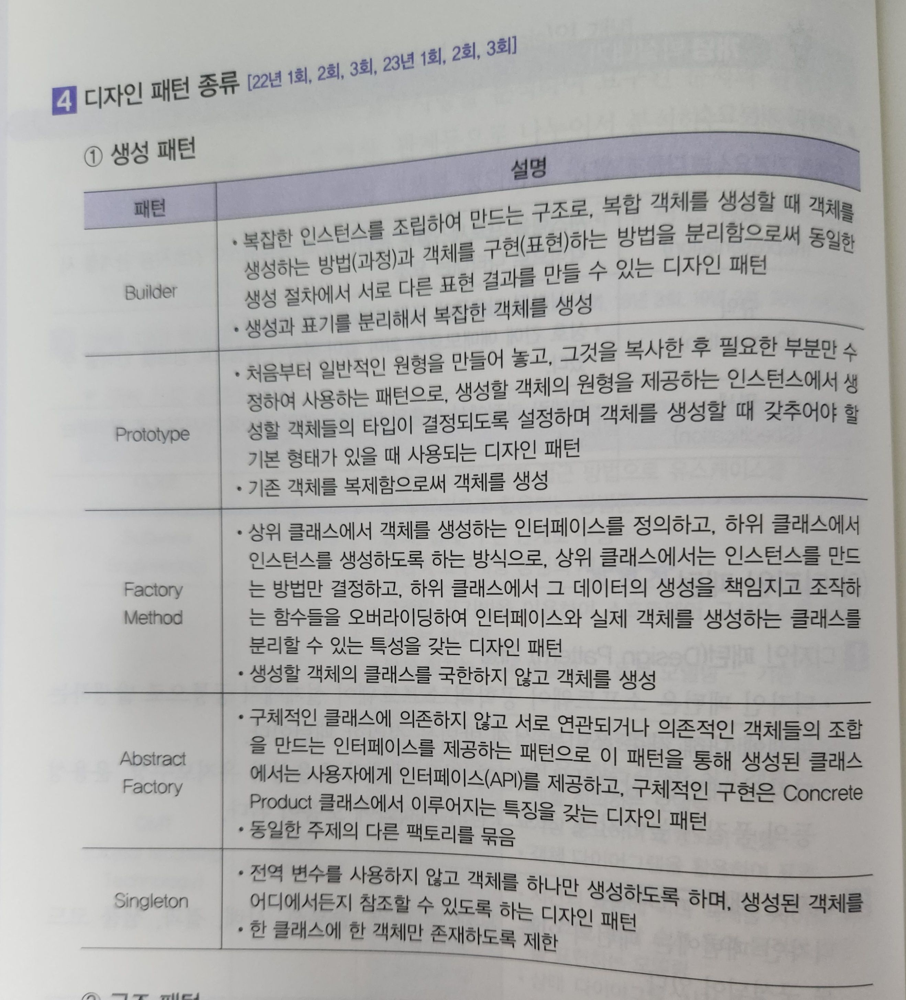
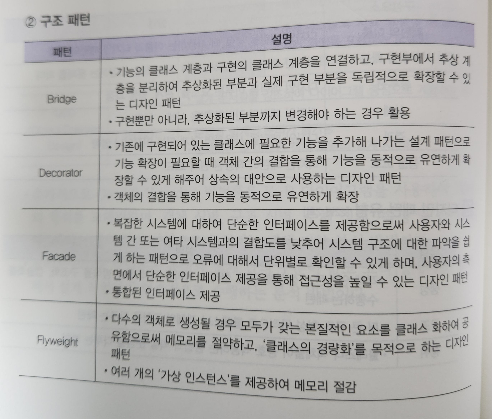
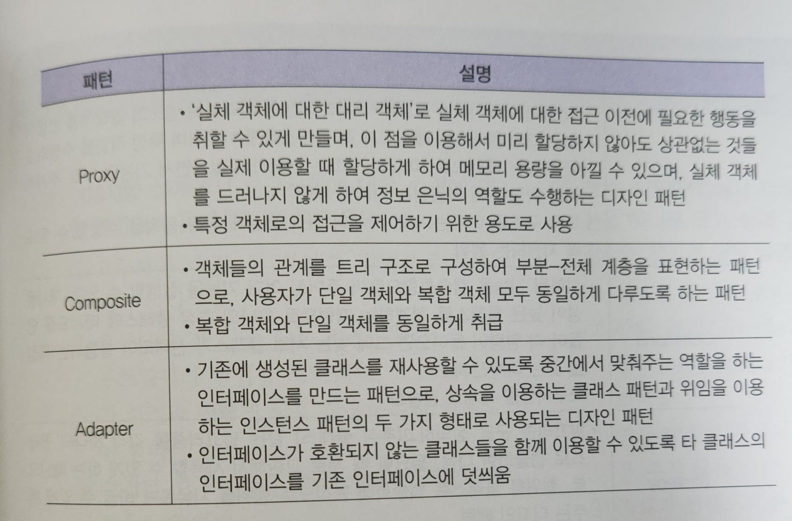
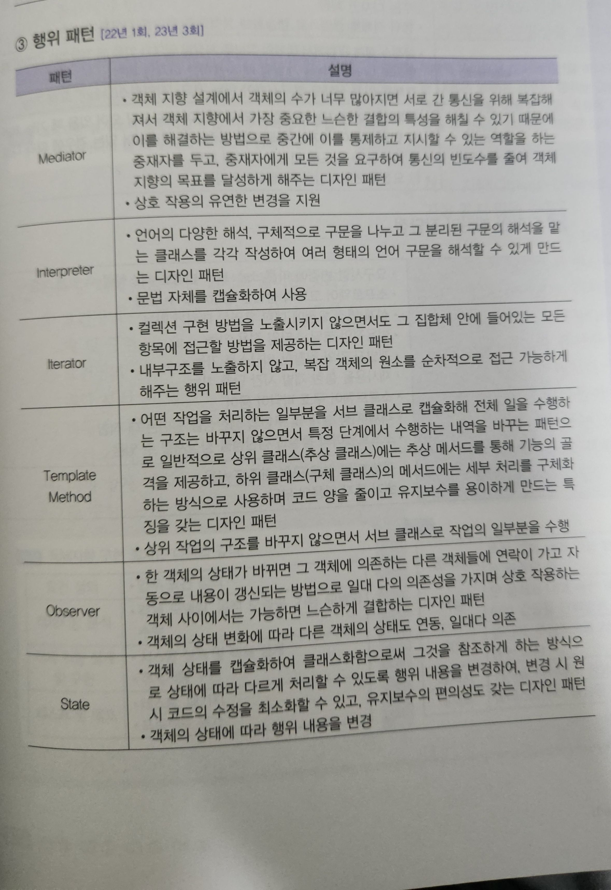
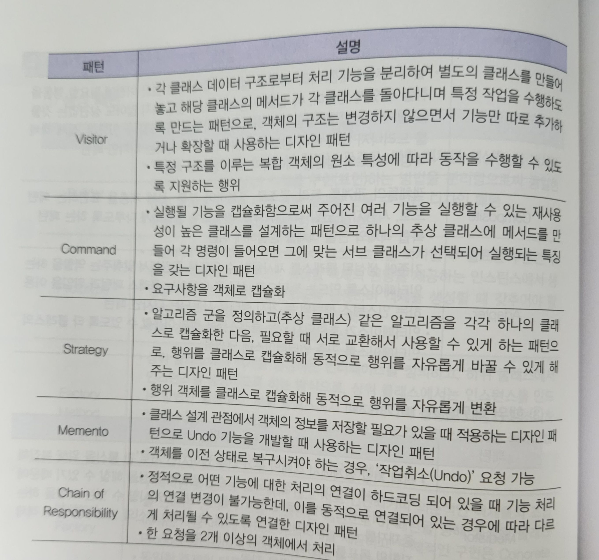

### Design Pattern

- SW 공학의 SW 설계에서 공통으로 발생하는 문제에 대해 자주 쓰이는 설계 방법을 정리한 패턴
- 디자인 패턴을 참고하여 개발한 경우 개발의 효율성과 유지보수성,  
	운용성 등의 품질이 높아지며 프로그램 최적화에 도움이 된다.
- `패턴 이름`, `문제 및 배경`, `솔루션`, `사례`, `결과`, `샘플 코드`로 구성됐다.

| 구성 요소         | 설명                                |
| ------------- | --------------------------------- |
| `패턴 이름`       | 디자인 패턴을 부를 때 사용하는 이름, 유형          |
| `문제 및 배경`     | 디자인 패턴이 사용되는 분야 또는 배경, 해결하는 문제 의미 |
| `Solution`    | 디자인 패턴을 이루는 요소들, 관계, 협동 과정        |
| `사례`          | 디자인 패턴의 간단한 적용 사례                 |
| `결과`          | 디자인 패턴을 사용하면 얻게 되는 이점이나 영향        |
| `Sample Code` | 디자인 패턴이 적용된 원시 코드                 |

---
### 디자인 패턴의 장/단점

#### 장점
- 요구 사항 변경에 따른 Source Code 변경을 최소화할 수 있게 해줌
- SW 코드의 품질을 향상시킬 수 있다.
- 설계 변경 요청에 대한 유연한 대체가 가능하다.
- 개발자 간 원활한 의사 소통이 가능하고, 재 사용을 통한 개발 시간 단축
- 객체 지향 설계 및 구현의 생산성을 높이는 데 적합하며  
	SW 품질과 생산성을 향상시킬 수 있다.

 

#### 단점
- 객체 지향 설계 및 구현 위주로만 사용
- 초기 투자 비용이 부담되는 편..

---
### 디자인 패턴 유형

- 디자인 패턴은 크게 `생성`, `구조`, `행위` 패턴으로 나뉘어진다.

| 유형      | 설명                                                                 |
| ------- | ------------------------------------------------------------------ |
| `생성 패턴` | 객체 `Instance` 생성에 관여, `class` 정의와  객체 생성 방식을 구조화, 캡슐화를 수행하는 패턴 |
| `구조 패턴` | 더 큰 구조 형성 목적으로 `class`나 객체의 조합을 다루는 패턴                             |
| `행위 패턴` | `class`나 객체들이 상호 작용하는 방법과 역할 분담을 다루는 패턴                            |

---

#### 생성 패턴 Creational Pattern

---

#### 구조 패턴 Structural Pattern

 

---

#### 행위 패턴 Behavioral Pattern

 

---