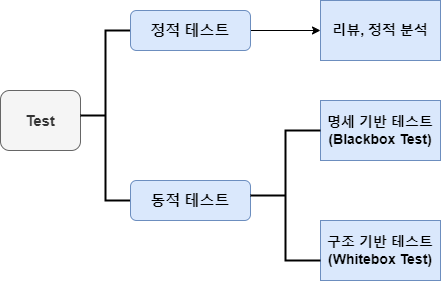
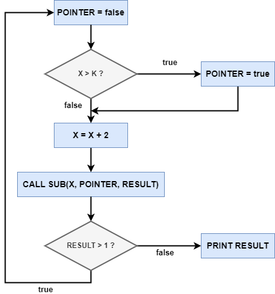

### SW Test

- SW 테스트는 `프로그램 실행 여부`, `테스트 상세 기법`, `테스트에 대한 시각`, 
	`테스트의 목적`, `테스트의 종류`에 따라 분류할 수 있다.

---

### `프로그램 실행 여부`에 따른 분류

- 프로그램 실행 여부에 따라 정적 테스트와 동적 테스트로 나뉘어 진다.

| 분류     | 설명                                          | 유형                                             |
| ------ | ------------------------------------------- | ---------------------------------------------- |
| 정적 테스트 | 테스트 대상을 실행하지 않고  구조를 분석하여 논리성을 검증하는 테스트 | 리뷰(`동료 검토/워크스루/인스펙션`) 정적 분석                |
| 동적 테스트 | SW 실행하는 방식으로 테스트를 수행  결함을 검출하는 테스트 기법   | Blackbox Test  Whitebox Test 경험 기반 테스트 |

- 경험 기반 테스트는 Blackbox Test에 포함되기도 한다.

---

### `테스트 상세 기법`에 따른 분류 ☆☆

### 1. Black-box Test

**▲ Black-box 테스트 예시 (분류 트리 테스트)**

- 프로그램 외부 사용자의 요구 사항 명세를 보면서 수행하는 테스트
- SW 특징, 요구 사항, 설계 명세서 등에 초점을 맞춰 테스트가 이루어진다.
- 기능 및 동작 위주의 테스트를 진행하기 때문에  
	내부 구조나 작동 원리를 알 지 못해도 가능하다.
- Black-box Test == 명세 테스트

| 유형                | 설명                                                                                                                      |
| ----------------- | ----------------------------------------------------------------------------------------------------------------------- |
| `동등 분할 테스트`       | 입력 데이터의 영역을 유사한 도메인 별로 `유효/무효값` Grouping  대푯값으로 Test Case 도출하여 테스트하는 기법                                             |
| `경곗값 분석 테스트`      | 등가분할 후 경곗값 부분에서 오류 발생 확률이 높기에  경곗값을 포함하여 테스트 케이스를 설계하여 테스트하는 기법  `최솟값 바로 위/최대치 바로 아래` 등 입력 값의 한계까지 테스트하는 기법 |
| `결정 테이블 테스트`      | 요구 사항의 논리와 발생 조건을 Table 형태로 나열하여  조건과 행위를 모두 조합하여 테스트하는 기법                                                          |
| `상태 전이 테스트`       | 테스트 대상/시스템이나 객체의 상태를 구분하고  이벤트에 의해 어느 한 상태에서 다른 상태로 전이되는  경우의 수를 수행하는 테스트 기법                                    |
| `Usecase Test`    | 시스템이 실제 사용되는 `Usecase`로 모델링이 되어 있을 때  프로세스 흐름을 기반으로 테스트 케이스를 명세화하여 수행하는 기법                                          |
| `분류 트리 테스트`       | SW의 일부 또는 전체를 `Tree 구조`로 분석 및 표현하여  테스트 케이스를 설계하여 테스트하는 기법                                                          |
| `페어와이즈 테스트`       | 테스트 데이터 간에 최소 한 번씩 조합하는 방식으로  커버해야 할 기능적 범위를 모든 조합에 비해  상대적으로 적은 양의 테스트 세트를 구성하기 위한 기법                          |
| `원인 - 결과 그래프 테스트` | `Graph` 활용하여 입력 데이터 간의 관계 및 출력에 미치는 영향 분석  효용성이 높은 테스트 케이스를 선정하여 테스트하는 기법                                           |
| `비교 테스트`          | 여러 버전의 프로그램에 같은 입력 값을 넣어서  동일한 결과 데이터가 나오는 지 비교해보는 테스트 기법                                                           |

---

### 2. White-box Test

**▲ White-box Test 예시**

- 각 응용 프로그램의 내부 구조와 동작을 검사하는 SW 테스트 기법
- 코드 분석과 프로그램 구조에 대한 지식을 바탕으로  
	문제가 발생할 가능성이 높은 모듈 내부를 직접 관찰하고 테스트하는 방법
- Source code의 모든 문장을 한 번 이상 수행함으로써 진행된다.
- 산출물의 기능 별로 적절한 프로그램의 제어 구조에 따라  
	선택, 반복 등의 부분들을 수행, 논리적 경로를 점검한다.
- `구조 기반 테스트`, `로직 기반 테스트`, `Glass box Test`라고도 부른다.

| 유형                                                         | 설명                                                                                        |
| ---------------------------------------------------------- | ----------------------------------------------------------------------------------------- |
| `Statement Coverage`  `구문/문장 커버리지`                     | 프로그램 내의 모든 명령문을 적어도 한 번 수행하는 커버리지  조건문 결과와 관계 없이 구문 실행 개수로 계산                         |
| `Decision Coverage` `결정/선택 커버리지`                       | 각 분기 결정 포인트 내의 전체 조건식이 적어도  한 번은 `true`와 `false`의 결과를 수행하는 테스트 커버리지                   |
| `Condition Coverage` `조건 커버리지`                         | 각 분기 결정 포인트 내의 각 개별 조건식이 적어도 한 번은  결과가 `true`나 `false`가 되도록 수행하는 테스트 커버리지             |
| `Condition/Decision Coverage` `조건/결정 커버리지`             | 전체 조건식뿐만 아니라 개별 조건식도 `true` 한 번, `false` 한 번 결과가 되도록 수행하는 테스트 커버리지                    |
| `Modified Condition/Decision Coverage` `변경 조건/결정 커버리지` | 개별 조건식이 다른 개별 조건식에 영향을 받지 않고  전체 조건식에 독립적으로 영향을 주도록 함으로써  `조건/결정 커버리지`에서 향상된 커버리지 |
| `Multiple Condition Coverage` `다중 조건 커버리지`             | 결정 조건 내 모든 개별 조건식의 모든 가능한 조합을  100% 보장하는 커버리지                                         |
| `Base Path Coverage` `기본 경로 커버리지`                      | 수행 가능한 모든 경로를 테스트하는 기법 기본 경로는 Cycle 허용 `맥케이브의 순환 복잡도` 기반으로 커버리지 계산                |
| `Control Flow Testing` `제어 흐름 테스트`                     | 프로그램 제어 구조를 그래프 형태로 나타내어 내부 Logic 테스트하는 기법                                            |
| `Data Flow Testing` `데이터 흐름 테스트`                       | 제어 흐름 그래프에 데이터 사용 현황을 추가한  그래프를 통해서 테스트하는 기법                                          |

---

### `테스트에 대한 시각`에 따른 분류

| 분류                | 설명                                                                                                                              |
| ----------------- | ------------------------------------------------------------------------------------------------------------------------------- |
| `검증 Verification` | SW 개발 과정을 테스트, 올바른 제품 생산하는 지 검증 이전 단계에서 설정된 개발 규격과 요구를 충족시키는 지 판단 개발자 or 시험자의 시각으로 SW가 명세화된 기능을 올바르게 수행하는 지 알아보는 과정 |
| `확인 Validation`   | SW 결과를 테스트, 만들어진 제품이 제대로 동작하는 지 검증 최종 사용자 요구 or SW 요구에 적합한 지 판단 사용자 시각으로 올바른 SW가 개발됐는 지 입증하는 과정                         |

---

### `테스트 목적`에 따른 분류

| 분류                                 | 설명                                                                  |
| ---------------------------------- | ------------------------------------------------------------------- |
| `Recovery Test` `회복 테스트`       | 시스템에 고의로 실패를 유도, 시스템 정상 복귀 여부를 테스트하는 기법                             |
| `Security Test` `보안 테스트`       | 불법적인 SW 접근하여 시스템을 파괴하지 못하도록  소스코드 내 보안적 결함을 미리 점검하는 테스트 기법      |
| `Performance Test` `성능 테스트`    | 사용자 event에 시스템 응답 시간, 처리량,  사용자 요구에 시스템이 반응하는 속도 등을 측정하는 테스트 기법 |
| `Stress Test` `강도 테스트`         | 시스템 처리 능력 이상의 부하 임계점 이상의 부하를 가하는 즉, 비정상적인 상황에서의 처리를 테스트하는 기법    |
| `Structure Test` `구조 테스트`      | 시스템 내부 논리 경로, 소스코드 복잡도를 평가하는 테스트 기법                                 |
| `Regression Test` `회귀(반복) 테스트` | 오류 제거, 수정한 시스템에서 이 과정에 의해  새로이 유입된 오류가 없는 지 확인하는 일종의 반복 테스트 기법  |
| `Parallel Test` `병행 테스트`       | 변경된 시스템과 기존 시스템에 동일한 데이터 입력  입력 후 결과를 비교해보는 테스트 기법              |

---

### SW Test 원리

| 분류             | 설명                                                                                                                                                                                                    |
| -------------- | ----------------------------------------------------------------------------------------------------------------------------------------------------------------------------------------------------- |
| 결함 존재 증명       | 테스트는 결함이 존재함을 밝히는 활동 결함 없음 == 증명 불가                                                                                                                                                               |
| 완벽 Testing 불가능 | `무한 경로`, `무한 입력 값`으로 인한 완벽한 테스트가 어렵다는 원리 `무한경로: 한 프로그램 내의 내부 조건 무수히 많을 수도 있음` `무한 입력 값: 입력이 가질 수 있는 모든 값 조합이 무수히 많음`                                                                          |
| 초기 집중          | 개발 초기에 체계적인 분석 및 설계가 수행되면 Testing 기간 단축 재작업 줄여 개발 기간을 단축 및 결함을 예방할 수 있는 원리  SW 개발 초기 체계적인 분석 및 설계가 수행되지 못하면  그 결과가 프로젝트 후반에 영향을 미치게 되어, 비용 커진다. => `요르돈 법칙 (Snowball Effect)` 적용됨 |
| 결함 집중          | 적은 수의 모듈에서 대다수 결함이 발견된다는 원리 Pareto 법칙의 내용인 `80:20` 법칙 적용                                                                                                                                          |
| 살충제 Paradox    | 동일한 테스트 케이스에 의한 반복적 테스트는  새로운 버그를 찾지 못한다는 원리                                                                                                                                                      |
| 정황 의존성         | SW의 성격에 맞게 테스트를 수행해야 한다는 원리                                                                                                                                                                           |
| 오류 - 부재의 궤변    | 요구 사항을 충족시켜주지 못한다면,  `결함 X == 품질 높음`이 성립되지 않는 원리                                                                                                                                                  |
|                |                                                                                                                                                                                                       |

---
