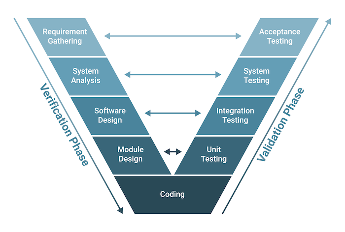

### Test case

- 특정 요구 사항에 준수하는 지를 확인하기 위해 개발된 <br/>
	입력 값, 실행 조건, 예상 결과의 집합이다.
- `식별자`, `테스트 항목`, `입력 명세`, `출력 명세` 등으로 구성됐다.

| 구성 요소                              | 설명                                                         |
| ---------------------------------- | ---------------------------------------------------------- |
| `식별자`<br/>`Identifier`             | 테스트 케이스를 고유하게 식별하기 위한 항목 식별자                               |
| `테스트 항목`<br/>`Test Item`           | 테스트할 모듈이나 기능에 대한 간략한 내용, 실행 조건                             |
| `입력 명세`<br/>`Input Specification`  | 테스트 실행 시 입력할 데이터 및 조건 <br/>(데이터: 입력 값, 선택 버튼, 체크 리스트 값...) |
| `출력 명세`<br/>`Output Specification` | 테스트 수행 시 필요한 HW나 SW 환경 <br/>테스트 시 사용할 물리적, 논리적 테스트 환경      |
| `환경 설정`                            | 테스트 수행 시 필요한 HW, SW 환경                                     |
| `특수 절차 요구`                         | 테스트 케이스 수행 시 특별히 요구되는 절차                                   |
| `의존성 기술`                           | 테스트 케이스 간의 의존성 및 종속성                                       |

- 위의 구성 요소 외에도 테스트를 거친 Application 기능의 <br/>
	성공, 실패를 판단하는 조건을 명확하게 작성해야 한다.

---

### Test Oracle

- 테스트의 결과가 `true`, `false`인지를 판단하기 위해서 <br/>
	사전에 정의해둔 참 값을 입력해서 결과와 비교하는 기법

| 종류                                   | 설명                                                                                             |
| ------------------------------------ | ---------------------------------------------------------------------------------------------- |
| `True Oracle`                        | 모든 입력 값에 대하여 기대하는 결과를 생성함으로써 <br/>발생된 오류를 모두 검출할 수 있는 기법                                       |
| `Sampling Oracle`                    | 특정한 몇 개의 입력 값에 대해서만 <br/>기대하는 결과를 제공해주는 기법                                                     |
| `Heuristic Oracle`                   | Sampling Oracle 개선한 버전 <br/>특정 입력 값에 대해 올바른 결과를 제공하고,<br/>나머지 값들에 대해서는 Heuristic(추정)으로 처리하는 기법 |
| `Consistent Oracle`<br/>`일관성 검사 오라클` | 애플리케이션 변경이 있을 때 <br/>수행 전, 후의 결과 값이 동일한 지를 확인하는 기법                                             |

---

### Test Level ☆☆☆

- 함께 편성되고 관리되는 테스트 활동의 그룹
- App 테스트는 SW 개발 단계에 따라 분류할 수 있는데<br/>
	이렇게 분류된 것을 **`Test Level`** 이라고 한다.
- 테스트 레벨은 프로젝트의 책임과 연관이 되어 있으며 <br/>
	각각의 테스트 레벨은 서로 독립적이다.

---

#### Test Level 종류



<p><b>▲ V - Model (테스트 레벨을 소프트웨어 개발 단계에 연결하여 표현한 그림)</b></p>
<br/>


| 종류                                 | 설명                                                | 기법                                                 |
| ---------------------------------- | ------------------------------------------------- | -------------------------------------------------- |
| `Unit Testing`<br/>`단위 테스트`        | 사용자 요구 사항에 대한 단위 모듈 <br/>Subroutine 등을 테스트하는 단계   | 인터페이스 테스트<br/>자료구조 테스트<br/>실행 경로 테스트<br/>오류 처리 테스트 |
| `Integration Testing`<br/>`통합 테스트` | 단위 테스트를 통과한 Component 간 <br/>인터페이스를 테스트하는 단계      | Bigbang 테스트<br/>'상향/하향' 식 테스트                      |
| `System Testing`<br/>`시스템 테스트`     | 개발 프로젝트 차원에서 정의된<br/>전체 시스템 or 제품 동작에 대해 테스트하는 단계 | 기능/비기능 요구사항 테스트                                    |
| `Acceptance Testing`<br/>`인수 테스트`  | 계약 상의 요구 사항이 만족됐는지를 <br/>확인하기 위한 테스트 단계           | Alpha/Beta 테스트                                     |

---

### 단위 테스트 Unit Testing

- SW 설계의 최소 단위인 모듈, Component에 초점을 둔 테스트
- 자료 구조, 인터페이스, 독립적 기초 경로, 오류 처리 경로 <br/>
	경계 조건, 외부적 I/O 등을 검사한다.
- **명세 기반 테스트 (블랙 박스 테스트)**, **구조 기반 테스트(화이트 박스 테스트)** 나뉘어 진다.
- 다만 주로 사용되는 테스트는 **구조 기반 테스트** 위주로 진행된다.

---

### 통합 테스트 Integration Testing

- `단위 테스트 Unit Testing` 완료한 모듈이나 Component 단위의 프로그램이 <br/>
	설계 단계에서 제시한 App과 동일한 구조와 기능으로 구현된 것 인지를 확인하는 테스트
- SW 각 모듈 간 인터페이스 관련 오류 및 결함을 찾아내기 위한 체계적인 테스트 기법

- `빅뱅 통합 테스트`, `상향식 통합 테스트`, `하향식 통합 테스트`, `샌드위치 통합 테스트`
- **`샌드위치 통합 테스트`**
	- 하위 프로젝트가 있는 큰 규모의 통합 테스트에서 사용하는 방식
	- 병렬 테스트와 시간 절약이 가능한 테스트 방식

| 테스트 기법                             | 설명                                                                                                                                                                                                        |
| ---------------------------------- | --------------------------------------------------------------------------------------------------------------------------------------------------------------------------------------------------------- |
| `Big-bang Test`                    | 모든 모듈을 동시에 통합 후 테스트 수행하는 방식 <br/>Driver/Stub 없이 실제 모듈로 테스트를 진행한다.                                                                                                                                         |
| `Top Down Test`<br/>`하향식 통합 테스트`   | 메인 제어 모듈, 프로그램으로부터 아래 방향으로 제어 경로를 따라가면서 <br/>하향식으로 통합하는 테스트 방식 <br/><br/>메인 제어 모듈에 해당하는 하위 모듈과 최하위 모듈은 <br/>'깊이-우선' / '너비-우선' 방식으로 통합된다.<br/><br/>모듈 및 모든 하위 Component 대신하는 <br/>더미 모듈인 `Test Stub` 필요하다. |
| `Bottom Top Test`<br/>`상향식 통합 테스트` | App 구조에서 최하위 레벨의 모듈 / 컴포넌트부터 점진적으로 <br/>싱위 모듈과 함께 테스트하는 기법 <br/><br/>상위 모듈에서 데이터 입/출력 확인하기 위한 <br/>더미 모듈인 `Test Driver`가 필요하다.                                                                            |

<br/>

```
1. Test Stub
- 모듈 및 모든 하위 컴포넌트를 대신하는 더미 모듈
- 하위 모듈의 반환 값만 전달한다.
- 제어 모듈이 호출하는 타 모듈의 기능을 단순히 수행하는 도구
  일시적으로 필요한 조건만 가지고 있는 시험용 모듈

2. Test Driver
- 상위의 모듈에서 데이터 입/출력을 확인하기 위한 더미 모듈
- 테스트 대상의 하위 모듈을 호출하고, 파라미터를 전달
  모듈 테스트 수행 후의 결과를 도출하는 도구
```

---

### 시스템 테스트 System Test

- 통합된 단위 테스트의 기능이 시스템에서 정상적으로 수행되는 지를 검증하는 테스트
- 컴퓨터 시스템을 완벽하게 검사하기 위한 목적 혹은 성능 목표를 가지고 테스트한다.
- `기능적 요구사항 테스트`, `비기능적 요구사항 테스트`로 구분된다.

| 종류              | 설명                                                                                      |
| --------------- | --------------------------------------------------------------------------------------- |
| `기능적 요구사항 테스트`  | `요구 사항 명세서`, `비즈니스 절차`, `Usecase` 등 <br/>명세서 기반의 Blackbox 테스트 기법                        |
| `비기능적 요구사항 테스트` | `성능 테스트`, `회복 테스트`, `보안 테스트`, `내부 시스템 메뉴 구조/웹 페이지 네비게이션` 등<br/> 구조적 요소에 대한 Whitebox 테스트 |


---

### 인수 테스트 Acceptance Test

- 최종 사용자와 업무의 이해 관계자 등이 테스트를 수행함으로써 <br/>
	개발된 제품에 대해 운영 여부를 결정하는 테스트
- 시스템의 일부 또는 특정한 비 기능적인 특성에 대해 인수 테스트를 통해 확인한다.
- `Alpha Test`, `Beta Test`

| 종류           | 설명                                                                                                                   |
| ------------ | -------------------------------------------------------------------------------------------------------------------- |
| `Alpha Test` | 선택된 `사용자`가 개발자 환경에서 통제된 상태로 <br/>개발자와 함께 수행하는 인수 테스트 <br/>`사용자`: 회사 내 다른 사용자 or 실제 사용자                               |
| `Beta Test`  | 실 환경에서 일정 수의 사용자에게  SW를 사용하게 하고 피드백을 받는 테스트<br/>Field Testing이라고도 하며, 개발자 없이 고객의 사용 환경에서<br/>SW 설치하여 검사를 수행하는 인수 테스트 |

---
