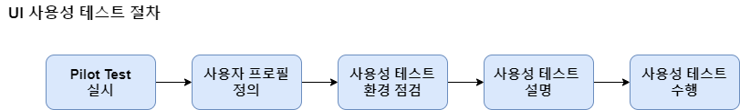

### 사용성 테스트 Usability Test

- 구현된 UI에 대하여 사용자가 직접 제품을 사용하면서 <br/>
	미리 작성된 시나리오에 맞춰서 과제를 수행한 후 질문에 답하는 테스트

- UI 시스템이나 SW UI를 구현한 개발자가 간과하기 쉬운<br/>
	발견하지 못한 문제점을 효율적으로 찾아내는 방법
- 사용성 테스트 기법으로는 `휴리스틱 평가`, `페이퍼 프로토타입 테스트`, <br/>
	`상태 전이 다이어그램 사용성 테스트` 등이 존재한다.

| 유형                                                   | 설명                                                                                                                                                                                                                                                    |
| ---------------------------------------------------- | ----------------------------------------------------------------------------------------------------------------------------------------------------------------------------------------------------------------------------------------------------- |
| `Heuristic Evaluation`<br/>`휴리스틱 평가`                 | 사용성에 대한 문제를 찾아내기 위한 방법<br/><br/>전문가에 의해 이론과 경험을 근거로 하여 일련의 규칙들을 만들어 놓고 <br/>평가 대상이 그러한 규칙들을 얼마나 잘 지키고 있는 가를 확인하는 평가 방법<br/><br/>상대적으로 비용이 적게 들어가며 <br/>짧은 시간 내에 시스템의 중요한 문제점들을 발견할 수 있는 기법<br/><br/>프로젝트 수행 전 단계 동안 테스트가 가능하여 <br/>초기에 문제점을 발견할 수 있다. |
| `Paper Prototype Evaluation`<br/>`페이퍼 프로토타입 평가`      | `Prototype`의 가장 빠른 방법으로 제품의 전반적인 컨셉과 흐름을 잘 보여주며 <br/>보는 사람들이 최종 제품에 대한 기대를 갖지 않고<br/>더 자유롭게 의견을 개진하면서 발전시킬 수 있는 기법                                                                                                                                    |
| `State Transition Diagram`<br/>`상태 전이 다이어그램 사용성 테스트` | 하나의 객체가 자신이 속한 `class`의 상태 변화 혹은 <br/>다른 객체의 상호 작용에 따라 상태가 어떻게 변화하는 지 <br/>표현하는 Diagram 이용하는 테스트 방법<br/><br/>객체가 가질 수 있는 상태가 어떤 것이 있는지, <br/>상태 별로 수신된 메시지에 대해서 어떤 행동을 보일지 기술함.                                                                       |
| `Online Survey(설문) 사용성 테스트`                          | 온라인 상에서 여러가지 태스크를 실시하여, 그 결과를 분석하는 방법<br/><br/>태스크 성공 여부, 태스크 기반 평가, 조건부 주석 및 설명, 태스크 시간, <br/>태스크 무작위화 , 태스크 윈도우 위치 선정, 참가자를 실행 조건에 할당하는 것을 <br/>무작위화 등의 온라인 조사를 통한 데이터의 유형 파악 가능                                                                    |
| `심층 인터뷰, 포커스 그룹 인터뷰`<br/>`사용성 테스트`                   | 사용자가 경험한 내용을 `심층 인터뷰`, `포커스 그룹 인터뷰`를 통해<br/>개방적 토의를 진행하고 그 자료를 분석하는 사용성 테스트 방법<br/><br/>인터뷰 대상자 및 조사자들이 서비스가 이루어지는 <br/>사회적이고 물리적인 환경에 대해 이해할 수 있도록 돕는 방법<br>                                                                                         |

---

### 사용성 테스트 도구

| 테스트 도구              | 설명                                                                                                                                     |
| ------------------- | -------------------------------------------------------------------------------------------------------------------------------------- |
| `UI Design`         | 인터페이스, 즉 정보기기나 소프트웨어의 화면 등 <br/>사람과 접하는 화면을 설계하고 디자인하는 것을 의미<br/><br/>`IA(Informaltion Architecture)` 설계와 인터랙션 설계, 디자인, GUI 디자인을 포함한다. |
| `UI Conception`     | UX 컨셉의 가시화 단계에서 진행되는 주요 화면에 대한 UI 컨셉 설계 의미<br/><br/>상세 설계 시 진행되는 UI 설계와 업무형태는 유사하지만<br/> UX 컨셉을 가시화하고 실제 설계 전에 검증하는 데 목적이 있음           |
| `GUI Conception`    | UI 컨셉션과 함께, 화면 디자인 관점에서 UX 컨셉을 가시화하는 것<br/><br/>주요 화면에 대한 시안을 디자인, 참조 이미지 등으로 <br/>컨셉을 검토할 수 있는 컨셉 보드를 제작하는 작업                         |
| `UX Concept Review` | 내부관계자, 사용자 등을 대상으로 UX 전략, UI 컨셉션, GUI 컨셉션의 결과물을 <br/>토대로 UX 전략이 잘 적용되었는지 검토하는 리뷰                                                       |
| `Concept Model`     | 여러 가지 추상적인 컨셉들 사이의 관계를 보여주는 다이어그램<br/>다양한 아이디어들을 간편하게 시각화하여 표현할 수있는 유용한 방법으로<br/>아이디어를 잘 전달하는 것뿐만 아니라. 생각의 과정을 효율적으로 이끌어 주는 모델         |
| `Mental Model`      | 사람들의 행동 동기, 사고 과정 뿐만 아니라<br/>그들이 행동하는 감성적, 철학적 배경에 대해서도 깊이 이해할 수 있도록 <br/>대표 사용자들에게서 에스노그래피 자료를 의미상 가까운 것끼리 모아 놓은 친화도 기법               |
| `Card Sorting`      | 정보 구조를 알 수 있는 가장 단순하면서도 효과적인 방법 중 하나<br/>아이디어와 컨셉을 작은 카드예 적고 <br/>사용자가 카드를 그룹으로 분류 및 정렬하여 정보를 구조화시키는 방법                                |

---

### 사용성 테스트 절차

- 사용성 테스트는 다음과 같은 절차로 수행된다.



| 절차                | 설명                                                                                                 |
| ----------------- | -------------------------------------------------------------------------------------------------- |
| `Pilot Test` 실시   | 파일럿 테스트 수행 절차 마련 <br/>파일럿 테스트를 통한 실제 테스트 소요 시간 예측 <br/>문제점 파악 및 유형 별 정리, 이해 관계자와 공유                |
| 사용자 프로필 정의        | 사용성 테스트를 수행하기 위한 사용자 프로필 기준 정의<br/>사용성 테스트 참여자의 카테고리 별로 사용자 프로필 정의<br/>테스트 참여 후보자 선정을 위한 인터뷰 실시    |
| 사용성 테스트<br/>환경 점검 | 사용성 테스트 진행 인력의 구성 점검<br/>사용성 테스트에 필요한 룸 환경, 장비 및 비품 점검<br/>사용성 테스트 참여자와 인터뷰                        |
| 사용성 테스트 설명        | 선정된 참여자들에게 테스트 취지 및 목적 설명<br/>테스트의 일정 및 방법 설명<br/>참여자들에게 개인정보 이용 동의서 등의 서류 작성 및 확인                 |
| 사용성 테스트 수행        | 대상 제품에 대한 사용성 테스트 과제의 순차적 실시<br/>테스트 중 문제점 및 이슈 사항 기록<br/>참여자에게 상세 내용 인텨뷰, 질의 응답<br/>테스트 결과 보고서 작성 |

```
Pilot Test
- 주로 컴퓨터 프로그램 등의 최신 기술을 개발하여
  실제 상황에서 실현하기 전에 소규모로 시험 작동해보는 것
  
- 대규모 프로젝트를 실행하기 전에 발생할 수 있는 여러 가지 변수들을 
  미리 파악해서 수정 및 보완하기 위해서 모의로 시행해보는 것
```

---
- 이후 내용은 정리 보류
- 중요성이 좀 떨어지는 느낌이 들어서 일단 보류 처리

