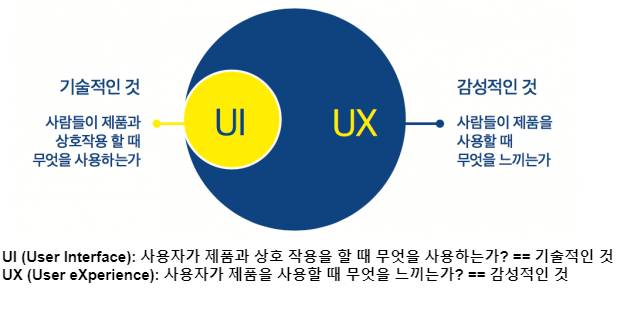

### UI와 UX

#### UI, User Interface

- 사용자와 시스템 사이에서 의사 소통할 수 있도록 고안된 물리적, 가상의 매개체 
- 정보 기기나 SW 화면 등에서 사람이 접하게 되는 화면 <= 좁은 의미 UI

#### UX, User eXperience
- 제품과 시스템, 서비스 등을 사용자가 직/간접적으로 경험하면서  
	느끼고 생각하는 총체적 경험
- 단순 기능, 절차 상 만족 만이 아니라 전반적인 지각 가능한 모든 면에서  
	사용자가 사용 또는 관찰하고 상호 교감을 통해서 알 수 있는 가치 있는 경험

---

### UI, User Interface

#### UI 유형

| 분류                                   | 설명                                                                                  |
| ------------------------------------ | ----------------------------------------------------------------------------------- |
| `CLI` `Command Line Interface`   | 정적 텍스트 기반 인터페이스 명령어를 텍스트로 입력, 조작하는 UI                                           |
| `GUI` `Graphical User Interface` | 그래픽 반응 기반 인터페이스 그래픽 환경 기반으로 한 마우스 등을 이용하는 UI                                    |
| `NUI` `Natural User Interface`   | 직관적 사용자 반응 기반 인터페이스 사용자가 가진 경험을 기반으로 키보드, 마우스 없이 신체 부위를 이용하는 UI (터치, 음성 포함) |
| `OUI` `Organic User Interface`   | 유기적 상호 작용 기반 인터페이스 입력 장치 => 출력 장치, 현실에 존재하는  모든 사물이 I/O 장치로 변화할 수 있는 UI     |

#### UI 특징

- 오류 최소화, 작업 기능 구체화, 상호 작용, 작업 시간 감소를 특징으로 가지고 있다.

| 분류        | 설명                         |
| --------- | -------------------------- |
| 오류 최소화    | 구현하고자 하는 결과의 오류를 최소화       |
| 작업 기능 최소화 | 막역한 작업 기능에 대해 구체적인 방법을 제시  |
| 상호 작용     | 사용자 중심의 상호 작용이 되도록 함       |
| 작업 시간 감소  | 사용자의 편의성을 높여 작업 시간을 감소시킨다. |

---

### UI 설계

#### UI 설계 원칙

| 설계 원칙                     | 설명                                                                                                                             |
| ------------------------- | ------------------------------------------------------------------------------------------------------------------------------ |
| `Intuitiveness` `직관성` | 누구나 쉽게 이해하고, 쉽게 사용할 수 있어야 한다.                                                                                                  |
| `Effectiveness` `유효성` | 정확하고 완벽하게 사용자의 목표가  달성될 수 있도록 제작한다.                                                                                        |
| `Learnability` `학습성`  | 초보, 숙련자 모두가 쉽게 배우고 사용할 수 있도록 제작한다.                                                                                             |
| `Flexibility` `유연성`   | 사용자의 `Interaction`을 최대한 포용하고  실수를 방지할 수 있도록 제작해야 한다.  `Interaction`  => IO 장치를 매개로 디지털 시스템과 사용자가 주고 받는 일련의 의사소통 과정 |

---

#### UI 설계 지침

| 설계 지침    | 설명                                                                |
| -------- | ----------------------------------------------------------------- |
| 사용자 중심   | 사용자가 이해하기 쉽고, 편하게 사용할 수 있는 환경을 제공하여 실 사용자에 대한 이해가 바탕이 되어야 한다. |
| 일관성      | 버튼, 조작 방법을 사용자가 기억하기 빠르고  쉽게 습득할 수 있도록 설계해야 한다.               |
| 단순성      | 조작 방법은 가장 간단하게 작동되도록 하여 인지적 부담 최소화                                |
| 결과 예측 가능 | 작동시킬 기능만 보고 결과 예측이 가능해야 한다.                                       |
| 가시성      | 주요 기능을 메인 화면에 노출, 쉬운 조작이 가능해야 한다.                                 |
| 표준화      | 디자인 표준화하여 기능 구조의 선행 학습 이후  쉽게 사용이 가능해야 한다.                    |
| 접근성      | 사용자의 직무, 연령, 성별 등이 고려된 다양한 계층을 수용해야 한다.                           |
| 명확성      | 사용자가 개념적으로 쉽게 인지해야 한다.                                            |
| 오류 발생 해결 | 사용자가 오류에 대한 상황을 정확하게 인지할 수 있어야 한다.                                |

---

