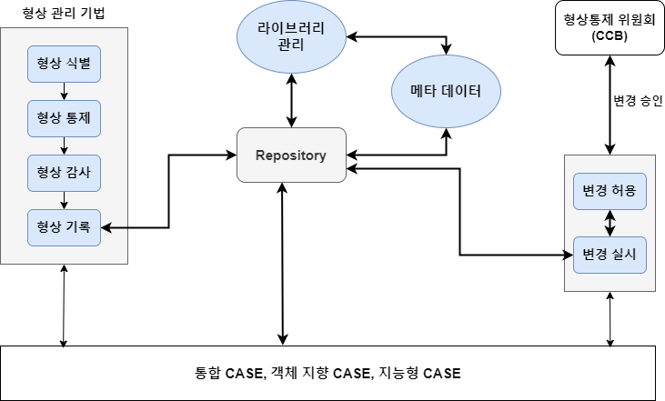

### 형상 관리 Configuration Management ☆☆☆



**▲ 형상 관리 개념도**

- SW LifeCycle 동안 발생하는 변경 사항을 체계적으로 관리하여 <br/>
	SW 품질 보증을 향상 시키는 관리적 활동
- 형상 항목의 `베이스 라인` 정하고 변경 사항을 관리하고 통제하는 활동
- 관리 항목으로는 `프로젝트 요구 분석서`, `소스코드`, `운영 및 설치 지침서`가 존재한다.
- 유지 보수 단계 만이 아니라 개발 단계에서도 형상 관리를 사용할 수 있다.

 ```
 베이스 라인 Baseline
 - SW 개발의 특정 시점에서 형상 항목이 하나의 완전한 산출물로 쓰일 수 있는 상태의 집합
 - 오직 공식적인 변경 통제 절차에 의해서만 변경될 수 있는 상태이다.
 ```

---

### 형상 관리 절차

- 형상 관리는 식별, 통제, 감사, 기록의 절차를 통해 생산성과 품질을 높일 수 있다.

| 절차    | 설명                                                                                                            |
| ----- | ------------------------------------------------------------------------------------------------------------- |
| 형상 식별 | 형상 관리 계획을 근거로 형상 관리의 대상을 식별하는 활동 <br/>추적성 부여를 위해 ID, 관리 번호를 부여한다.<br/>변경 관련 Issue 발생 시, ID와 관리 번호를 이용하여 추적한다. |
| 형상 통제 | 형상 항목의 변경 사항에 대하여, `CCB`가 승인/기각/보류를 결정 <br/>승인된 변경 사항의 이행을 체계적으로 통제하는 활동 <br/><br/>형상 항목의 버전 관리를 위한 운영        |
| 형상 감사 | 형상 관리 계획대로 형상 관리가 진행되고 있는지 <br/>형상 항목의 변경이 요구 사항에 맞게 이뤄졌는지 등을 살펴보는 활동<br/>Baseline 변경 시 요구 사항과 일치 여부를 검토한다.   |
| 형상 기록 | SW 형상 및 변경 관리에 대한 각종 수행 결과를 기록하는 활동<br/>형상 결과 보고서 작성                                                          |

---

### 형상 관리 도구

- SW 변경 사항을 관리하기 위해서 형상 식별, 통제, 감사, 기록을 수행하는 도구
- 소스 코드나 문서의 버전 관리, 이력 관리, 추적 등 <br/>
	변경 사항을 체계적으로 관리할 수 있는 기능을 제공하는 도구
- 대표적으로 `CVS`, `SVN`, **`Git`** 존재한다.

#### 기능

| 기능          | 설명                                                                    |
| ----------- | --------------------------------------------------------------------- |
| `Check-In`  | 개발자가 수정한 소스를 형상 관리 저장소로 업로드하는 기능                                      |
| `Check-Out` | 형상 관리 저장소로부터 최신 버전을 개발자의 PC로 다운 받는 기능                                 |
| `Commit`    | 개발자가 소스를 형상 관리 저장소에 업로드 후 최종적으로 업데이트가 됐을 때<br/>형상 관리 서버에서 반영하도록 하는 기능 |

---
#### `Concurrent Versions System, CVS`
- 가장 오래된 형상 관리 도구 중 하나
- 중앙 집중형 서버 저장소를 두고, `Client`가 접속해서 버전 관리를 실행하는 <br/>
	형상 관리 도구

| 주 기능        | 설명                                                                               |
| ----------- | -------------------------------------------------------------------------------- |
| `변경 사항 동기화` | `Check-In`, `Check-out`, `Commit`, `Update` 등 <br/>서버 저장소와 클라이언트의 변경 사항 전송 기능 제공 |
| `파일 단위 관리`  | 파일 단위로 변경 사항 관리가 가능 <br/>`Diff`를 통한 파일 내용의 비교 가능                                 |

| 장점                   | 단점                    |
| -------------------- | --------------------- |
| 직관적이고 비교적 단순한 명령 Set | 텍스트 기반 소스코드 위주 지원     |
|                      | 등록된 파일 및 디렉토리 변경 불편   |
|                      | 커밋 실패 등에 대한 롤백 기능 미지원 |

---
#### `Subversion, SVN`

- 중앙 집중형 `Client-Server` 방식으로 `CVS`의 단점을 보완해서 <br/>
	가장 널리 사용되고 있는 형상 관리 도구

| 주 기능             | 설명                                                                |
| ---------------- | ----------------------------------------------------------------- |
| `CVS 기능 제공`      | `CVS`의 대부분의 명령어 수행 가능                                             |
| `Binary File 관리` | `CVS`에선 텍스트 기반 파일만 가능했지만 <br/>`SVN`은 실행 파일과 같은 Binary File을 지원한다. |
| `롤백 기능 지원`       | `Commit` 실패 시 Rollback 가능                                         |

| 장점                       | 단점                                               |
| ------------------------ | ------------------------------------------------ |
| Directory 파일을 자유롭게 이동 가능 | `Trunk`, `Branch`, `Tag` 모두 물리적 저장 위치 점유         |
| `CVS`에 비해 비약적으로 빨라진 속도   | 잦은 `Commit`으로 인해 <br/>`Revision` 번호가 크게 증가할 수 있음 |
| `Gzip` 압축하여 공간 절약 가능     | 개별 개발자만의 개발 이력을 가질 수 없다.                         |
| 다양한 `Plugin API` 제공      |                                                  |

---
#### `Git`

- `Linus Torvals`가 2005년 `Linux kernel` 개발을 위해 만든 형상 관리 시스템
- 주 기능으로 `로컬/원격 형상 관리`, `이관 기능` 등이 존재한다.

| 주 기능             | 설명                                                                                                           |
| ---------------- | ------------------------------------------------------------------------------------------------------------ |
| `Local/원격 형상 관리` | `branch`, `Check-out`, `Commit` 등 Local 환경에서의 형상 관리 기능 제공<br/>`Push`, `Fetch`, `Pull` 등 원격 환경에서의 형상 관리 기능 제공 |
| `이관 기능`          | `Commit` 실패 시 Rollback 가능                                                                                    |

```
Local 저장소와 원격 저장소 처리 속도
- 기본적으로 로컬 저장소가 원격 저장소보다 처리 속도가 빠르다.
- 다만 로컬 저장소는 원격 저장소가 단순히 속도 때문에 존재하는 것이 아니라
  형상 관리를 분산시키기 위해서 존재하는 것이기에 다소 느릴 수 밖에 없다.
  
- SVN의 경우 원격 서버에 문제가 생겨서 접근하지 못한다면 형상 관리를 사용할 수 없지만
  Git의 경우에는 로컬 저장소에 저장을 해놨다가, 원격 서버가 복구되면
  Commit을 하는 등의 조치가 가능하다.
```

| 장점                         | 단점                              |
| -------------------------- | ------------------------------- |
| 저장소의 완전한 복사본을 Local에 저장 가능 | 대용량 코드 관리에 부적절하다.               |
| Local 저장을 통해 Offline 작업 가능 | 한 번에 `diff` 명령어를 통한 변경사항 보기 어려움 |
| 일시적인 작업에 대한 이력 관리가 수월함.    | `CVS`, `SVN`과 개념이 상이, 별도 학습이 필요 |

---
