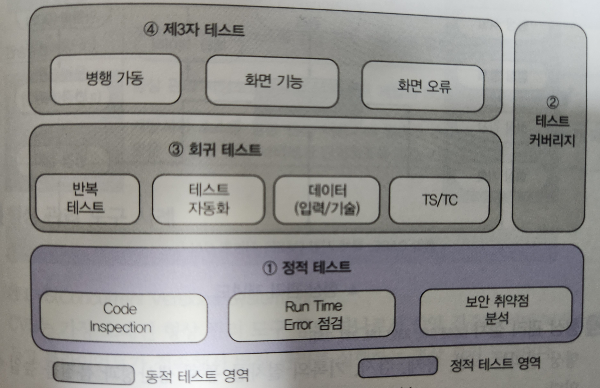

### 소스 코드 검증 기법

- 언어 유형 별로 Build하는 과정이 상이하다.
- `Compile`, `Byte Code`, `Interpreter` 별로 코드를 빌드하는 과정이 다르다고 한다.

| 언어 유형                                                  | 설명                                                                                                                                                    |
| ------------------------------------------------------ | ----------------------------------------------------------------------------------------------------------------------------------------------------- |
| `Compile` (`C`, `C++`...)                          | 기계어로 바로 변환되어 실행, 속도가 빠르고 보안에 유리함 소스 변경 시마다 컴파일을 통해서 빌드 작업 수행=> 빌드 과정 오래 걸림                                                                        |
| `Byte Code` (`Java`, `C#`, ...)                    | 컴파일 결과물이 실행 파일이 아닌 `Byte Code` 파일로 생성 가상 실행 환경인 `JRE`, `CLI`에서 한 줄씩 실행하는 방식으로 빌드  가상 머신 환경에서 실행될 때, 기계어로 변환되고  컴파일 언어에 비해 빌드 과정이 빠르다. |
| `Interpreter` (`JavaScript`, `Python`, `Ruby`,...) | 컴파일 언어와는 다르게 한 줄씩 번역되어 실행된다. 컴파일 과정에서 메모리가 훨씬 적게 소모되고 단 시간 내에 컴파일 진행된다.                                                                           |

---

### Source code 검증 도구

**▲ 소스 코드 검증 도구 구분**

- 구현된 SW를 실행하지 않고 테스트하는 `정적 테스트 도구`  
	구현된 SW를 실행하여 동작을 보면서 테스트하는 `동적 테스트 도구` 구분된다.

| 구분          | 설명                                                                                    |
| ----------- | ------------------------------------------------------------------------------------- |
| `정적 테스트 도구` | 작성된 소스 코드를 실행시키지 않고, 코드 자체만으로 코딩 표준 준수 여부  코딩 스타일 적정 여부, 잔존 결함 발견 여부를 확인하는 테스트 도구 |
| `동적 테스트 도구` | 구현된 SW를 실행하여 동작을 보면서 테스트하는 도구                                                         |

---

