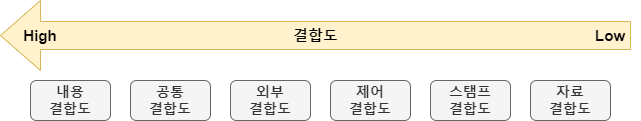
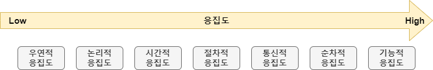

## 모듈화 Modularization

- 프로그램 개발 시 생산성과 최적화, 관리에 용이하게 기능 단위로 분할하는 기법
- 프로그램 구성하는 데이터와 함수들을 묶어서 하나의 모듈을 생성한다.

```
모듈 Module
- 프로그램을 구성하는 시스템을 기능 단위로 독립적인 부분으로 분리한 것
- 하나 이상의 논리적인 기능을 수행하기 위한 명령어들의 집합
```

```
장점
1). 프로그램의 효율적인 관리가 가능해지고, 성능이 향상된다.
2). SW 이해와 용이성 증대와 복잡성이 감소한다.
3). 기능의 분리가 가능해지고, 인터페이스가 단순해진다.
4). 모듈의 재사용이 가능해지기 때문에 개발과 유지보수가 수월해진다.
```

#### 모듈화 원리

| 원리                                 | 설명                                                        |
| ---------------------------------- | --------------------------------------------------------- |
| `모듈 독립성`<br/>`Module Independency` | 낮은 `결합도`와 높은 `응집도` 가지게 된다.                                |
| `분할과 정복`<br/>`Divide & Conquer`    | 모듈 단위로 분할했기 때문에 <br/>복잡한 문제가 발생해도, 문제가 발생한 모듈에서 해결이 가능하다. |
| `데이터 추상화`<br/>`Data Abstraction`   | 각 모듈 자료 구조에 접근하고 수정하는 함수 내에 <br/>자료 구조의 표현 내역을 은폐할 수 있다.  |
| `정보 은닉`<br/>`Information Hiding`   | 외부에서 변경해선 안되는 모듈을 타 모듈로부터 은폐한다,                           |

#### 모듈화 측정 지표

- 모듈화의 적정성을 측정하는 지표는 `응집도 Cohesion`, `결합도 Coupling`이다.
- 좋은 모듈화 == 용도에 맞게 각 기능 별 모듈들로 세분화된 것
- 각 모듈은 **독립적으로** 주어진 역할만 수행하고, 타 모듈과의 의존성이 높아선 안된다.
- 모듈의 독립성은 `결합도`와 `응집도`에 따라 달라진다. <br/>
	`독립성`은 높이기 위해서는 모듈 간 `결합도` 낮추고, `응집도` 높여서 <br/>
	모듈의 크기를 작게 만들어야 한다.
- 즉, **`결합도`는 낮을수록 좋고, `응집도`는 높을수록 좋다는 것이다.**

- 다만 무조건 모듈의 크기가 작다고 좋은 것이 아니다.
- 모듈이 작아질수록 그 개수도 늘어나고, 통신 횟수가 증가하면 <br/>
	과부화로 인해 성능이 떨어지고 복잡도가 증가하기 때문이다.
- 따라서 모듈의 크기를 결정할 때는 문제 특성, 유형에 알맞게 결정해야 한다.

---

### 모듈화 유형

- 모듈화는 기본적으로 `설계 측면`, `구현 측면` 나뉘게 된다.
- `설계 측면`에서의 모듈화의 유형으로는 `Module`, `Component`, `Service` 존재하고
- `구현 측면`에선 `Function`, `Macro`, `Inline`이 존재한다.


#### 모듈화 유형 / 설계 측면

| 유형          | 설명                                                            |
| ----------- | ------------------------------------------------------------- |
| `Module`    | 설계 시 연관된 기능을 한 부분에 모아두고 <br/>라이브러리 형태로 사용한다.                  |
| `Component` | `Binary` 형태의 재 사용이 가능한 형태 <br/>인터페이스에 의해 Logic 수행할 수 있는 모듈 단위 |
| `Service`   | 기존 Component보단 `느슨한 결합` 형태의 기능을 제공하는 모듈 단위                    |

```
느슨한 결합 Loosely Coupled
- 다른 class를 직접적으로 사용하는 class의 의존성 줄여서
  코드의 재사용성과 유연성을 높이는 기법
```


#### 모듈화 유형 / 구현 측면

| 유형         | 설명                                                                  |
| ---------- | ------------------------------------------------------------------- |
| `function` | 프로그램 구현 시, 프로그램 일부 코드로 특정 작업을 수행하는 <br/>상대적으로 다른 코드에 비해 독립적인 Module |
| `Macro`    | 프로그램에서 반복되는 부분에 특정한 이름 부여하고 <br/>해당 이름을 통해서 실행할 수 있게 하는 기법          |
| `Inline`   | 프로그램 구현 시 반복되는 부분에 특정 이름 부여<br/>해당 이름 통해서 실행할 수 있게 하는 프로그램 기법       |

---

### 결합도 Coupling

- 모듈 내부가 아닌 외부 모듈과의 연관도 or 모듈 간 상호 의존성 나타내는 척도
- SW 구조에서 모듈 간 관련성 측정하는 척도
- `결합도`는 다음과 같은 특징을 가지고 있다.

| 특징        | 설명                                      |
| --------- | --------------------------------------- |
| 모듈 연관성 없음 | 서로 다른 상위 모듈에서 호출, 처리 상 연관성이 없는 다른 기능 수행 |
| 인터페이스 의존성 | 자료 전달이 인터페이스 통과하여 인터페이스 복잡성에 의존적이다.     |
| `복잡성` 감소  | 낮은 결합도를 통해 복잡성이 감소한다.                   |
| 파급효과 최소화  | 에러 발생 시 오류가 전파, 다른 오류의 원인이 되는 파급효과를 최소화 |

- [복잡성이란 무엇인가?](https://brunch.co.kr/@taehyo/11)


---

#### 결합도 유형



- 결합도는 유형은 다음과 같다.
- `내용`>`공통`>`외부`>`제어`>`스탬프`>`자료 결합도` (`내.공.외.제.스.자`)
- 왼쪽으로 갈수록 결합도가 높아지고, 오른쪽으로 갈 수록 결합도가 낮아진다.

| 유형                               | 설명                                                                                                                                                                                    |
| -------------------------------- | ------------------------------------------------------------------------------------------------------------------------------------------------------------------------------------- |
| `내용 결합도`<br/>`Content Coupling`  | 다른 모듈 내부의 변수, 기능을 다른 모듈에서 사용하는 경우의 결합도<br/>하나의 모듈이 직접적으로 다른 모듈 내용 참조할 때 <br/>두 모듈은 내용적으로 결합되어 있는 경우의 결합도                                                                              |
| `공통 결합도`<br/>`Common Coupling`   | Parameter가 아닌 모듈 외부에 선언된 전역 변수 참조하고 <br/>해당 변수를 갱신하는 식의 상호작용을 하는 경우의 결합도                                                                                                              |
| `외부 결합도`<br/>`Externel Coupling` | 두 개의 모듈이 외부에서 도입된 통신 프로토콜이나 <br/>디바이스 인터페이스를 공유하고 있는 경우의 결합도                                                                                                                          |
| `제어 결합도`<br/>`Control Coupling`  | 어떤 모듈이 다른 모듈의 내부 논리 조직을 제어하기 위한 목적으로 <br/>제어 신호를 이용하여 통신하는 경우의 결합도 <br/><br/>하위 모듈에서 상위 모듈로 제어 신호가 이동하여 <br/>하위 모듈이 상위 모듈에게 처리 명령을 부여하는 <br/>`권리 전도 현상`이 발생하는 결합도 (`역천 易天`이라고 이해하자..) |
| `스탬프 결합도`<br/>`Stamp Coupling`   | 모듈 간 인터페이스로 `배열`, `객체`, `구조` 등이 전달되는 경우의 결합도<br/><br/>두 모듈이 동일한 자료 구조를 조회하는 경우의 결합도, <br/>자료 구조의 변화가 발생하면, 해당 자료 구조 참조하는 <br/>모든 모듈에게도 영향을 준다.                                        |
| `자료 결합도`<br/>`Data Coupling`     | 모듈 간 인터페이스로 전달되는 파라미터를 통해서만 <br/>모듈 간 상호작용이 일어나는 경우의 결합도 <br/><br/>한 모듈의 내용을 변경해도, 다른 모듈에겐 영향이 가지 않으므로 <br/>가장 바람직한 `결합도`라고 할 수 있다.<br/>(모듈 간 의존성 낮음. / `Stamp Coupling`과는 상반되는 특성)   |

---

### 응집도 Cohesion

- 모듈의 독립성을 나타내는 개념, 모듈 내부 구성요소 간 연관성 정도
- `정보 은닉`의 확장 개념, **"하나의 모듈은 하나의 기능을 수행하는 것"** 의미한다.


```
특징

(1). 유사 기능 영역 구성
- class 목적에 부합하는 같은 기능 영역의 함수들로 구성한다.

(2). 단일 책임 할당
- 함수의 개수가 상대적으로 적고, 오로지 자신만이 할 수 있는 책임을 할당 받는다.

(3). 함수 간 상호협력
- 하나의 함수에 많은 기능을 넣지 않고 다른 함수와 협력한다.
```


---

#### 응집도 유형



<br/>

- 응집도의 유형은 다음과 같다.
- `우연적`<`논리적`<`시간적`<`절차적`<`통신적`<`순차적`<`기능적` (`우논시절 통순기`)
- 왼쪽으로 갈 수록 응집도가 낮아지고, 오른쪽으로 갈 수록 응집도가 높아진다.

| 유형                                     | 설명                                                                                                                   |
| -------------------------------------- | -------------------------------------------------------------------------------------------------------------------- |
| `우연적 응집도`<br/>`Coincidental Cohesion`  | 서로 간 어떤 의미 있는 연관 관계도 없는<br/> 기능 요소로 구성될 경우의 응집도 <br/><br/>서로 다른 상위 모듈에 의해 호출. 처리 상 연관성 없는 <br/>서로 다른 기능을 수행할 경우의 응집도 |
| `논리적 응집도`<br/>`Logical Cohesion`       | 유사한 성격을 가지거나, 특정 형태로 분류되는 <br/>처리 요소들이 한 모듈에서 처리되는 경우의 응집도                                                           |
| `시간적 응집도`<br/>`Temporal Cohesion`      | 연관된 기능보단 특정 시간에 처리되어야 하는<br/>활동들을 한 모듈에서 처리하는 경우의 응집도                                                                |
| `절차적 응집도`<br/>`Procedural Cohesion`    | 모듈이 다수의 관련 기능을 가지고 있을 때<br/>모듈 안 구성 요소들이 그 기능을 순차적 수행할 경우의 응집도                                                       |
| `통신적 응집도`<br/>`Communication Cohesion` | 동일한 입/출력 사용하여 다른 기능을 수행하는<br/>활동들이 모여있을 경우의 응집도                                                                      |
| `순차적 응집도`<br/>`Sequential Cohesion`    | 모듈 내에서 한 활동으로부터 나온 출력 값을<br/>다른 활동이 사용할 경우의 응집도                                                                      |
| `기능적 응집도`<br/>`Functional Cohesion`    | 모듈 내부 모든 기능이 단일 목적 위해서 <br/>수행되는 경우의 응집도                                                                             |

- `응집도` 낮으면 하나의 모듈 내부에 다양한 기능을 구현하여 독립성이 낮아진다.
- `응집도` 높으면 모듈 하나에 하나의 기능만을 분리 구현하므로 <br/>
	독립성이 보장되고, 변경이 쉬워서 유지보수가 편리하다.

---
