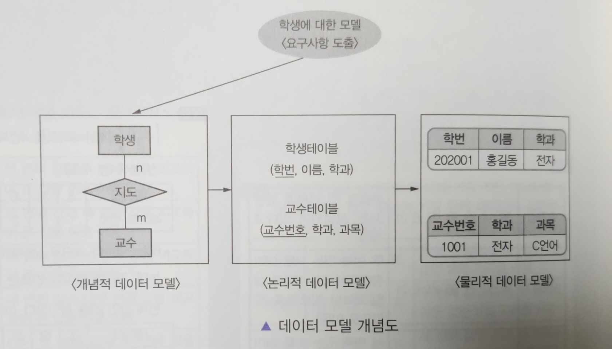
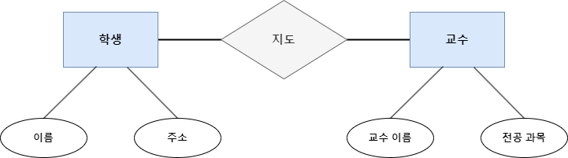
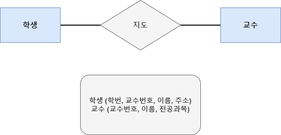
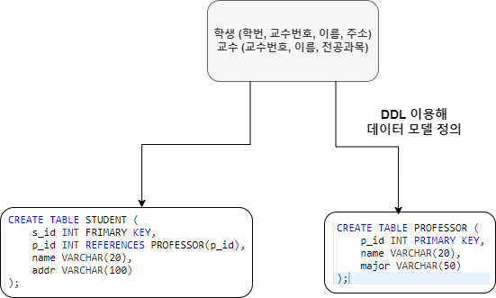
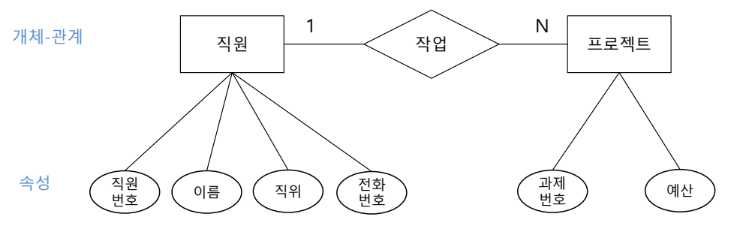

### 데이터 모델 Data Model



<br/>

- 현실 세계의 정보를 인간과 컴퓨터가 이해할 수 있도록 추상화하여 표현한 모델
- 데이터 모델에는 논리적 데이터 `구조`, `연산`, `제약 조건` 요소를 표시해야 한다.

| 요소                        | 설명                                                                     |
| ------------------------- | ---------------------------------------------------------------------- |
| `Structure` <br/>`구조`     | DB에 논리적으로 표현될 대상으로서의 개체 타입과 개체 타입 들 간의 관계 <br/>데이터 구조 및 정적 성질을 표현하는 요소 |
| `Operation` <br/>`연산`     | DB에 저장된 실제 데이터를 처리하는 작업에 대한 명세 <br/>DB 조작하는 요소                         |
| `Constraint` <br/>`제약 조건` | DB에 저장될 수 있는 실제 데이터의 논리적인 제약 조건                                        |

---

### DB 설계 / 데이터 모델 분류

- DB 설계는 `요구 조건 분석` - `개념적 설계` - `논리적 설계` - `물리적 설계`로 단계가 나뉘어 진다.

#### 1. 요구 조건 분석

- 도출된 요구 사항 간 상충을 해결하고, 범위를 파악하여 <br/>
	외부 환경과의 상호 작용을 분석을 통해 데이터에 대한 요구 분석한다.

---

#### 2. 개념적 설계



- 사용자의 요구에 대한 개념적 Schema, Transaction을 모델링 하는 단계
- 개념적 데이터 모델은 현실 세계에 대한 인식을 추상적, 개념적으로 표현하여 <br/>
	개념적 구조를 도출하는 데이터 모델

```
- 트랜잭션 모델링, View 통합 방법 및 Attribute 합성 고려
- 개념적 데이터 모델은 DB 종류와 관계가 없음
- 주요 산출물은 '개체 관계 다이어그램'이 있음
```

---

#### 3. 논리적 설계



- Transaction의 인터페이스를 설계하는 단계
- DBMS에 맞는 논리적 Schema를 설계하는 단계
- 논리적 데이터 모델은 업무의 모습을 모델링 표기법으로 형상화하여 <br/>
	사람이 이해하기 쉽게 표현한 데이터 모델

```
- 논리적 설계 단계에서 정규화를 수행
- 논리적 DB 구조로 Mapping
- Schema 평가 및 정제
- 논리적 데이터 모델을 통해 '관계 데이터 모델', '계층 데이터 모델', '네트워크 데이터 모델',
  '객체지향 데이터 모델', '객체-관계 데이터 모델' 중 하나의 모델에 맞게 설계
- RDB (관계형 DB)에서는 테이블을 설계하는 단계
```

---

#### 4. 물리적 설계



- 논리 데이터 모델을 특정 DBMS의 특성 및 성능을 고려하여 물리적인 Schema를 만드는 단계
- 물리적 데이터 모델은 논리 데이터 모델을 사용하고자 하는 각 DBMS의 특성을 고려 <br/>
	DB 저장 구조, 물리 데이터 모델로 변환하는 모델

```
- `Table`, `Index`, `View`, `Partition` 등 객체를 생성
- 응답 시간, 저장 공간의 효율화, 트랜잭션 처리를 고려하여 설계
- 성능 측면에서 '반 정규화' 수행한다.
  - 반 정규화 De-Normalization
    - 정규화된 엔티티, 속성, 관계에 대해 성능 향상과 개발 운영의 단순화를 위해
      중복, 통합, 분리 등을 수행하는 데이터 모델링 기법
- 레코드 집중의 분석 및 설계
- 저장 레코드 양식 설계
- 접근 경로 설계
```

---

### 개체 - 관계 모델 (E - R)

- 개체 - 관계 모델, E-R은 현실 세계에 존재하는 데이터와 그들 간의 관계를 <br/>
	사람이 이해할 수 있는 형태로 명확하게 표현하기 위한 Peter chen이 제안한 모델
- E-R은 `개체 Entity`, `속성 Attribute`, `관계 Relationship` 세 가지로 구성됐다.

| E-R 구성                  | 설명                                                               |
| ----------------------- | ---------------------------------------------------------------- |
| `개체` <br/>`Entity`      | 사물, 사물 등의 유/무형의 정보를 가지고 있는 요소 <br/>물리 단계에서 `Table`로 변환한다.        |
| `속성`<br/>`Attribute`    | 개체가 갖는 속성을 의미한다. <br/>물리 단계에서 `Column`으로 변환한다.                   |
| `관계`<br/>`Relationship` | 두 개 이상의 개체 사이에 존재하는 연관성 <br/>1:1, 1:N (1: 다수), N:M (다 : 다) 관계 존재 |

---

#### E-R Diagram 예시



<br/>

| 구성         | E-R 다이어그램 | 기호    |
| ---------- | --------- | ----- |
| 개체         | **`□`**   | 사각형   |
| 관계         | `◇`       | 마름모   |
| 속성         | **`○`**   | 타원    |
| 다중 값 속성    | **`◎`**   | 이중 타원 |
| 관계 - 속성 연결 | **`-`**   | 선     |

---

### 논리적 데이터 모델링

- 업무의 모습을 모델링 표기법으로 형상화하여 사람이 이해하기 쉽게 표현하는 프로세스
- 논리적 데이터 모델은 데이터 간의 관계를 표현하는 형태에 따라 <br/>
	`관계 데이터 모델`, `계층 데이터 모델`, `네트워크 데이터 모델`로 나뉘어 진다.

| 종류              | 설명                                                                                                                                        |
| --------------- | ----------------------------------------------------------------------------------------------------------------------------------------- |
| **관계 데이터 모델**   | 논리적 구조가 2차원 `Table` 형태로 구성된 모델 <br/>기본 키 (Primary Key)와 이를 참조하는 외래 키 (Foreign Key)로 관계를 표현한다. <br/> `1:1`, `1:다수`, `다수:다수` 관계를 자유롭게 표현한다. |
| **계층 데이터 모델**   | 논리적 구조가 `Tree` 형태로 구성된 모델 <br/>상하 관계가 존재한다. <br/>`1: 다수` 관계만 허용한다.                                                                        |
| **네트워크 데이터 모델** | 논리적 구조가 `Graph` 형태로 구성된 모델 <br/>상위와 하위 레코드 사이에 `다수 : 다수 / N:M` 관계를 만족하는 구조 <br/>Owner-Member 관계 존재 <br/>**CODASYL DBTG MODEL** 불리기도 한다.   |

---

