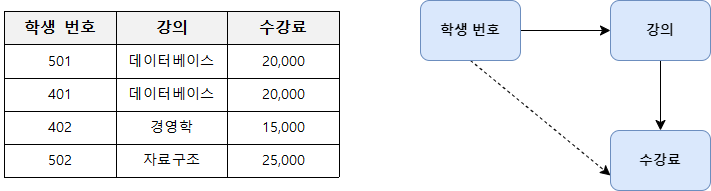
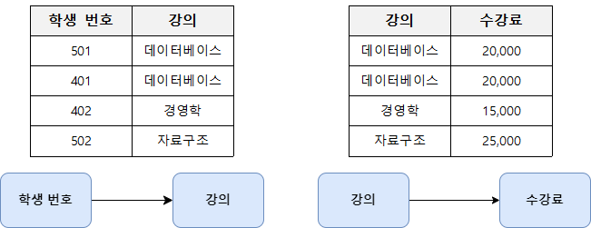
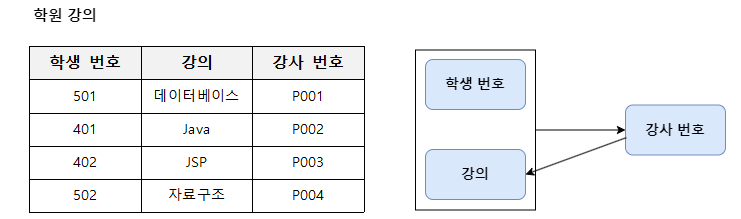

### 데이터베이스 정규화 DB Normalization

- DB 설계한 후에 설계 결과물을 검증하기 위해 사용하는 방법

- 관계형 데이터 모델에서 데이터의 중복성을 제거하여 **`이상 현상`** 방지하고 <br/>
	데이터의 일관성과 정확성을 유지하기 위해 무손실 분해하는 과정
	
- 테이블 간에 중복된 데이터를 허용하지 않는 것을 기본 목표로 삼고 있다.

- 중복된 데이터를 허용하지 않음으로써, 무결성(Integrity)를 유지할 수 있으며 <br/>
	DB의 저장 용량 역시 줄이는 것이 가능하다.

- 이러한 테이블이 어떤 식으로 분해되는 지에 따라 정규화 단계가 달라진다.

#### DB 정규화의 목표

- 수정 및 삭제 시 이상 현상을 최소화함으로써 데이터 구조의 안정성 최대화한다.

- 어떠한 Relation이라도 DB 내에서 표현을 가능하게 하고 <br/>
	데이터 삽입 시 Relation의 재구성에 대한 필요성을 줄인다.

- 이상 현상 제거를 위해 데이터의 종속성을 줄여야 함.
- 어떤 Relation 구조가 바람직한 것인지, 바람직하지 못한 Relation을 <br/>
	어떤 식으로 분해해야 하는 지에 대한 구체적인 판단 기준을 제공한다.

```
이상 현상 Anomaly
- Relation 조작 시 데이터들이 불필요하게 중복되어 예기치 않게 발생하는 현상
- 삽입 이상, 삭제 이상, 갱신 이상이 존재한다.

(1). 삽입 이상 Insertion Anomaly
- Relation에 데이터를 삽입할 때, 의도한 것과는 상관 없이
  원하지 않는 값도 같이 삽입되는 현상

(2). 삭제 이상 Deletion Anomaly
- Relation에서 한 Tuple을 삭제할 때 의도와는 
  상관 없는 값들도 같이 삭제되는 연쇄가 일어나는 현상

(3). 갱신 이상 Update Anomaly
- Relation에서 한 Tuple에 있는 속성 값을 갱신할 때
  일부 튜플의 정보만 갱신되어 정보의 모순이 생기는 현상
```

---
### DB 정규화와 정규형 종류

- 앞에서 정규화란 데이터의 일관성과 정확성을 유지하기 위해 <br/>
	테이블을 분해한다고 했었다.
- Relation이 정규화된 정도는 `정규형 Normal Form, NF`으로 표현하고 <br/>
	이러한 정규형은 기본 정규형과 고급 정규형으로 나뉘어 진다.
- 기본 정규형에는 `제 1 정규형`, `제 2 정규형`, `제 3 정규형`, `보이스/코드 정규형`이 있고 <br/>
	고급 정규형에는 `제 4 정규형`, `제 5 정규형`이 존재한다.

| 구분           | 정규화 단계                                         | 조건                               |
| ------------ | ---------------------------------------------- | -------------------------------- |
| **`기본 정규형`** | **`제 1 정규형` <br/>`1NF`**                       | 원자 값으로 구성                        |
| **`기본 정규형`** | **`제 2 정규형`<br/>`2NF`**                        | 부분 함수의 종속 제거 <br/>(완전 함수적 종속 관계) |
| **`기본 정규형`** | **`제 3 정규형` <br/>`3NF`**                       | 이행 함수의 종속 제거                     |
| **`기본 정규형`** | **`보이스/코드 정규형` <br/>`Boyce/Codd Normal Form`** | 결정자가 후보 키가 아닌 함수 종속 제거           |
| **`고급 정규형`** | **`제 4 정규형` <br/>`4NF`**                       | 다중 값 종속성 제거                      |
| **`고급 정규형`** | **`제 5 정규형` <br/>`5NF`**                       | `JOIN` 종속성 제거                    |

```
함수 종속
- 어떤 Relation R에서 X와 Y를 각각 R의 Attribute 집합의 부분 집합이라고 할 경우
  속성 X의 값 각각에 대해 시간과 관계 없이 항상 Y의 값이 오직 하나만 연관되어 있는 관계
- 표기: 'X → Y (Y는 X에 함수 종속)'
```
---

### 제 1 정규화 1NF

- 테이블의 Column이 원자 값, 하나의 값을 갖도록 테이블을 분해하는 것


- 위의 테이블에서 '추신수'와 '박세리'는 여러 개의 취미를 가지고 있는데 <br/>
	이는 제 1 정규형을 만족하지 못하기 때문에, 제 1 정규화를 진행해서 <br/>
	위의 이미지처럼 테이블의 컬럼이 원자 값, 하나의 값만 갖게 된다.

---

### 제 2 정규화 2NF

- 제 1 정규화를 진행한 테이블에 대해 완전 함수 종속을 만족하도록 테이블 분해하는 것
- 완전 함수 종속 : 기본 키, PK의 부분 집합이 결정자가 되어선 안된다는 것


```
- 위의 테이블에서 기본 키는 '학생 번호'와 '개설된 강의'로 복합 키이다.
  여기서 (학생 번호, 개설된 강의)인 기본 키는 '성적'을 결정하고 있다.
- 그리고 강의실 Column은 기본 키의 부분 집합인 '개설된 강의'에 의해 결정된다.

- 즉, 기본 키 (학생 번호, 개설된 강의)의 부분 집합인 '개설된 강의'가 결정자이므로
  위의 테이블에서 강의실을 분해, 별도의 테이블로 관리하는 것으로
  제 2 정규형을 만족시킬 수 있다.
```

---

### 제 3 정규화 3NF

- 제 2 정규화를 진행한 테이블에 대해 이행적 종속을 없애도록 테이블을 분해하는 것
- 이행적 종속: `A → B`, `B → C`가 성립될 때, `A → C`가 성립되는 것



- 위의 테이블에서 학생 번호는 강의를 결정하고 있고, 강의는 수강료를 결정하고 있다. <br/>
	(학생 번호 → 강의), (강의 → 수강료)이므로 (학생 번호 → 수강료)가 성립된다.

- 즉 위의 테이블은 이행적 종속이 성립되기 때문에 <br/>
	위의 테이블을 `학생 번호 → 강의`, `강의 → 수강료` 테이블로 분해해야 한다.

- 제 3 정규화를 진행한 결과물은 다음과 같다.



---

### 보이스/코드 정규화 BCNF

- 제 3 정규화를 진행한 테이블에 대해 모든 결정자가 후보 키가 되도록 테이블을 분해하는 것



- 위의 학원 강의 테이블에서 기본 키는 `[학생 번호, 강의]`이고 <br/>
	기본 키는 강사 번호를 결정하고 있으며, 여기서 강사 번호는 강의를 결정하고 있다.
- 여기서 강사 번호는 강의를 결정하는 결정자이지만, 후보키는 아니다.
- BCNF는 모든 결정자가 후보 키가 돼야 하므로 위의 테이블을 아래와 같이 분해할 수 있다.
- 학원 강의 테이블을 `[학생 번호, 강사 번호]`, `[강사 번호 → 강의]` 테이블로 분해하였다.


---

- 제 4 정규화와 제 5 정규화는 특수한 경우에서만 사용된다고 한다.
- 즉 필기 출제 빈도가 높은 편이 아니라는 것이다.
- 그렇기 때문에 제 4 정규화와 제 5 정규화는 별도로 정리하지 않는다.

---


