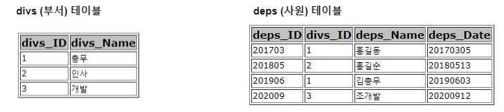
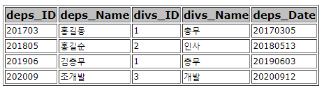

## Join

- 두 개 이상의 Table 연결해서 데이터를 검색하는 방법
- SQL 명령문에 의해서 여러 테이블에 저장된 데이터를 한 번에 조회할 수 있게 하는 DBMS 기능
- 두 개 이상의 Relation에서 관련된 Tuple들을 결합해서 <br/>
	하나의 Tuple로 만드는 대표적인 데이터 연결 방법
- 논리적 조인과 물리적 조인 두 가지로 나뉘어 진다.

| 구분       | 설명                                               | 유형                                    |
| -------- | ------------------------------------------------ | ------------------------------------- |
| `논리적 조인` | 사용자 SQL 문에 표현되는 테이블 결합 방식                        | `내부 조인`<br/>`외부 조인`                   |
| `물리적 조인` | DB 옵티마이저 (DBMS 엔진)에 의해 <br/>내부적으로 발생하는 테이블 결합 방식 | `중첩 반복 조인`<br/>`정렬 합병 조인`<br/>`해시 조인` |

---

### 내부 조인 Inner Join

- Join 조건에서 동일한 값이 있는 행만 반환하는 조인

``` sql
SELECT 컬럼_명 FROM 테이블1 INNER JOIN 테이블2 ON 조건절;
```




- 위의 이미지와 같은 `deps(사원)` 테이블과 `divs(부서)` 테이블이 존재한다고 가정해보자.
- 이제 여기서 `사원 아이디`, `사원 이름`, `부서 아이디`, `부서 명`, `입사일` 한 번에 조회하려고 한다.
- `부서 아이디`와 `부서 명`은 `divs` 테이블에 존재하고 <br/>
	`사원 아이디`, `사원 이름`, `입사일`은 `deps` 테이블에 존재한다.
- 이를 한 번에 보여주기 위해서는 `deps`와 `divs` 테이블을 Join해야 한다.

``` sql
SELECT deps.deps_ID, 
deps.deps_Name, deps.divs_ID, 
divs_Name, deps_Date
FROM deps
INNER JOIN divs
ON deps.divs_ID = divs.divs_ID;
```




---

