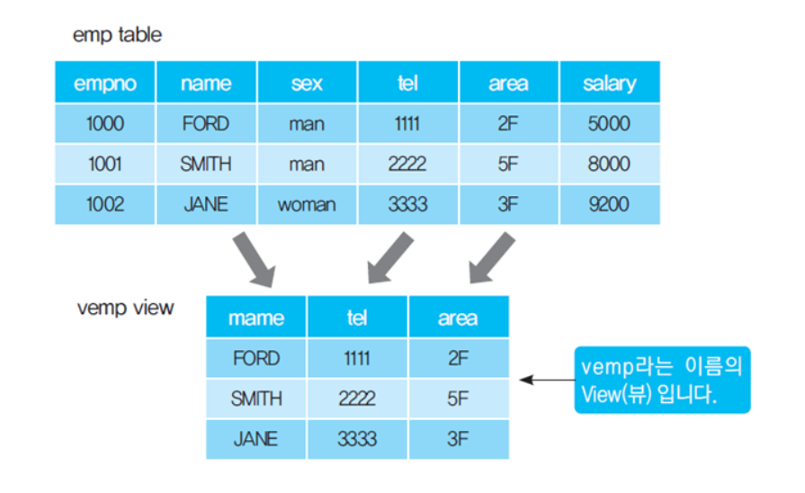

## View



- 하나 또는 둘 이상의 기본 테이블로부터 유도되어 만들어지는 가상 테이블
- 위의 그림에서 `emp`는 `물리 테이블` 의미하고<br/>
	`vemp` 테이블은 위의 테이블을 가공하여 생성한 `view` 의미한다.
- 상단의 그림처럼 View는 하나의 물리 테이블로부터 생성이 가능하고 <br/>
	다수의 테이블이나 다른 View 활용해서 새로운 View 만드는 것도 가능하다.

---

### View 장점과 단점

#### 장점

- `논리적 독립성 제공`
	- DB에 영향을 주지 않고, App이 원하는 형태로 데이터 접근 가능
	
- `데이터 조작 연산 간소화`
	- App이 원하는 형태의 논리적 구조 형성하여 데이터 조작 연산 간소화
	- 복수 테이블에 존재하는 여러 종류의 데이터에 대해 <br/>
		단순한 질의어를 사용할 수 있다.
	- `SELECT * FROM VIEW_NAME;`
	
- `보안 기능 제공 (접근 제어 기능 제공)`
	- 특정 필드만 선택해서 View 생성하는 경우에는 <br/>
		애플리케이션은 선택되지 않는 나머지 필드의 조회와 접근이 불가능하다.
	- 중요 보안 데이터를 저장하고 있는 `Table`, `Column`에는 접근할 수 없다.

#### 단점
- `View 자체 Index 불가` 
	- `Index`: 물리적으로 저장된 데이터를 대상으로 한다.
	- 논리적 구성인 View에서는 인덱스를 가질 수 없다.
	
- `View 변경 불가`
	- View의 정의를 변경하려면, View를 삭제하고 다시 생성해야 한다.
	- `ALTER`문 이용해서 View의 정의를 변경할 수 없음 <br/>
		`CREATE`문 사용해서 정의, 삭제 시에는 `DROP`문 사용
	
- `데이터 변경 제약 존재`
	- View의 내용에 대한 삽입/삭제/변경에는 제약이 존재한다.

---

### View 명령어

#### 생성

``` sql
/*CREATE VIEW '뷰이름_컬럼_목록' AS '데이터_조회_Query'*/

/*A 테이블에서 전체 Column 가져옴*/
CREATE VIEW VW_A AS
SELECT * FROM A;

/* A 테이블에서 일부 Column만 가져오기*/
CREATE VIEW VW_A AS
SELECT C1, C2 FROM A;
```

#### 변경 및 삭제

``` sql
/*View Delete*/
/* DROP VIEW '삭제할_뷰_이름'*/
DROP VIEW VW_A;
```

- View 정의 자체를 변경하는 것은 불가능하다.
- 즉, 이름이나 Query 문을 변경하는 수단이 제공되지 않는다는 것이므로
- View에 대한 정의 변경은 View의 삭제 및 재생성을 통해서 이루어진다.

#### 생성한 View 조회하기

``` sql
/*View 구조 확인하기*/
DESC VW_A;

/*View 조회하기*/
SELECT * FROM VW_A;
```

---

